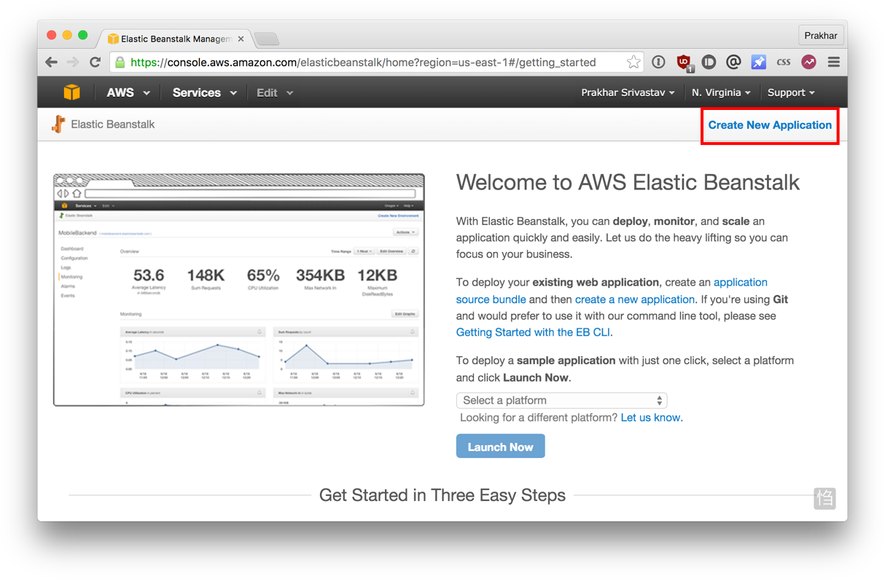
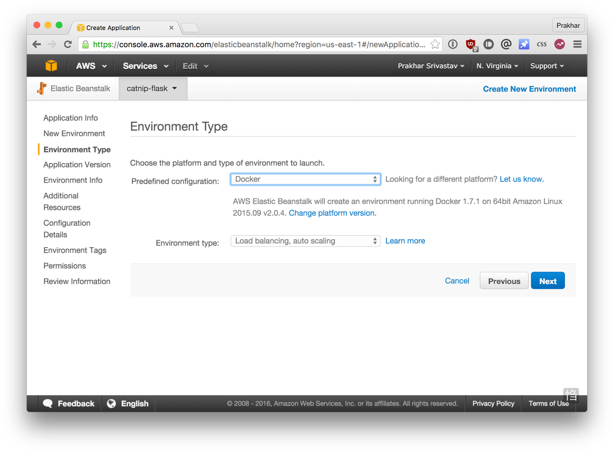

<a id="top"></a>


*Build and deploy your distributed applications easily to the cloud with Docker*

Written and developed by [Prakhar Srivastav](http://prakhar.me) and [ADI](https://adicu.com/).

<a href="#top" class="top" id="getting-started">Top</a>

## Getting Started: FAQs

### What is Docker?
Wikipedia defines [Docker](https://www.docker.com/) as 

> an open-source project that automates the deployment of software applications inside **containers** by providing an additional layer of abstraction and automation of **OS-level virtualization** on Linux.

Wow! That's a mouthful. In simpler words, Docker is a tool that allows developers, sys-admins etc. to easily deploy their applications in a sandbox (called *containers*) to run on the host operating system i.e. Linux. The key benefit of Docker is that it allows users to **package an application with all of its dependencies into a standardized unit** for software development. Unlike virtual machines, containers do not have the high overhead and hence enable more efficient usage of the underlying system and resources.


### What are containers?

The industry standard today is to use Virtual Machines (VMs) to run software applications. VMs run applications inside a guest Operating System, which runs on virtual hardware powered by the server’s host OS.

VMs are great at providing full process isolation for applications: there are very few ways a problem in the host operating system can affect the software running in the guest operating system, and vice-versa. But this isolation comes at great cost — the computational overhead spent virtualizing hardware for a guest OS to use is substantial.

Containers take a different approach: by leveraging the low-level mechanics of the host operating system, containers provide most of the isolation of virtual machines at a fraction of the computing power.


### Why should I use it?

As developers, we are cognizant of the power we hold in our hands - the ability to build apps to share with the entire world is very empowering. However, one key aspect of that realization involves deploying our application either on the cloud, a datacenter or even a single server. Given that apps today involve so many components - an application server, a database, a caching layer etc. deploying and managing these architectures is extremely complex.


By standardizing an application and its dependencies into a container, Docker enables us to build, test and release our apps quickly and easily. Due to its benefits of efficiency and portability, Docker has been gaining mindshare rapidly is now leading the **Containerization** movement. As a developer going out into the world, it is important that we understand this trend and see how we can benefit from it.

### What will this tutorial teach me?
This tutorial will give you a hands-on experience with deploying a docker container on [Amazon Web Services](http://aws.amazon.com) (AWS). It will demystify the docker landscape, clarify the differences between images and containers and finally, deploy a python application on the cloud.

## Using this Document
This document contains a series of several sections, each of which explains a particular aspect of Docker. In each section, we will be typing commands (or writing code). All the code used in the tutorial is available in the [Github repo](http://github.com/prakhar1989/docker-curriculum).


<a href="#top" class="top" id="table-of-contents">Top</a>
## Table of Contents

-	[Preface](#preface)
    -	[Prerequisites](#prerequisites)
    -	[Setting up your computer](#setup)
-   [1.0 Playing with Busybox](#busybox)
    -   [1.1 Docker Run](#dockerrun)
    -   [1.2 Terminology](#terminology)
-   [2.0 Webapps with Docker](#webapps)
    -   [2.1 Static Sites](#static-site)
    -   [2.2 Docker Images](#docker-images)
    -   [2.3 Our First Image](#our-image)
    -   [2.4 Dockerfile](#dockerfiles)
    -   [2.5 Docker on AWS](#docker-aws)
-   [Additional Resources](#resources)
-   [References](#references)


------------------------------
<a href="#table-of-contents" class="top" id="preface">Top</a>
## Preface

<a id="prerequisites"></a>
### Prerequisites
There are no specific skills needed for this tutorial beyond a basic comfort with the command line and using a text editor. Prior experience in developing web applications would be helpful but not required. As we proceed further along the tutorial, we'll make use of a few cloud services. If you're interested in following along, please create an account on each of these websites - 

- [Amazon Web Services](http://aws.amazon.com/)
- [Docker Hub](https://hub.docker.com/)

<a id="setup"></a>
### Setting up your computer
Getting all the tooling setup on your computer can be a daunting task, but thankfully as Docker has become stable getting it up and running on your favorite OS has become very easy. At first, we'll install docker.

##### Docker 
Until a few releases ago, running docker on OSX and Windows was quite a hassle. Lately however, docker has invested significantly into improving the on-boarding experience for its users on these OSes and hence running Docker now is a cakewalk. The *getting started* guide on Docker has detailed instructions for setting up Docker on [Mac](http://docs.docker.com/mac/step_one/), [Linux](http://docs.docker.com/linux/step_one/) and [Windows](http://docs.docker.com/windows/step_one/).

Once you are done installing docker, test your docker installation by running the following
```
$ docker run hello-world

Hello from Docker.
This message shows that your installation appears to be working correctly.
...
```

##### Python
Python comes pre-installed on OSX and (most) Linux distributions. We'll also be using [pip](https://pip.readthedocs.org/en/stable/) for installing packages for our application.

If don't have pip installed, please [download](http://pip.readthedocs.org/en/stable/installing/) it for your system.

```
$ python --version
python --version
Python 2.7.10

$ pip --version
pip 7.1.2 from /Library/Python/2.7/site-packages/pip-7.1.2-py2.7.egg (python 2.7)
```

##### Java
The app that we'll be developing will be using [Elasticsearch](https://www.elastic.co/) for storage and search. In order to run elasticsearch locally, make sure you Java installed. If Java is installed, typing `java -version` in your terminal should give you an output similar to the one below.

```
$ java -version
java version "1.8.0_60"
Java(TM) SE Runtime Environment (build 1.8.0_60-b27)
Java HotSpot(TM) 64-Bit Server VM (build 25.60-b23, mixed mode)
```
___________

<a href="#table-of-contents" class="top" id="preface">Top</a>
<a id="busybox"></a>
## 1.0 Playing with Busybox
Now that we have everything setup, it's time to get our hands dirty. In this section, we are going to run a [Busybox](https://en.wikipedia.org/wiki/BusyBox) (a lightweight linux distribution) container on our system and get a taste of the `docker run` command.

To get started, let's run the following in our terminal 
```
$ docker pull busybox
```

> Note: Depending on how you've installed docker on your system, you might see a `permission denied` error on running the above command. If you're on a Mac, make sure docker engine is running. If you're on Linux, then prefix your `docker` commands with `sudo`. Alternatively you can [create a docker group](http://docs.docker.com/engine/installation/ubuntulinux/#create-a-docker-group) to get rid of this issue.

What the `pull` command does is it fetches the busybox **image** from the **docker registry** and saves it in our system. You can use the `docker images` command to see a list of all images on your system.
```
$ docker images
REPOSITORY              TAG                 IMAGE ID            CREATED             VIRTUAL SIZE
busybox                 latest              c51f86c28340        4 weeks ago         1.109 MB
```

<a id="dockerrun"></a>
### 1.1 Docker Run
Great! Lets now lets run a docker **container** based on this image. To do that we are going to use the almighty `docker run` command. 

```
$ docker run busybox
$
```
Wait, nothing happened! Is that a bug? Well, no. Behind the scenes, a lot of stuff happened. When you call `run`, the docker client finds the image (busybox in this case) loads up the container and then runs a command in that container. When we run `docker run busybox`, we didn't provide a command so the container booted up, ran an empty command and then exited. 
Well, yeah - kind of a bummer. Let's try something more exciting.

```
$ docker run busybox echo "hello from busybox"
hello from busybox
```
Nice - finally we see some output. In this case, the docker client dutifully ran the `echo` command in our busybox container and then exited it. If you've noticed, all of that happened pretty quickly. Imagine booting up a virtual machine, running a command and then killing it. Now you know why they say containers are fast! Ok, now it's time to see the `docker ps` command. The `docker ps` command tells you what all containers are currently running.

```
$ docker ps
CONTAINER ID        IMAGE               COMMAND             CREATED             STATUS              PORTS               NAMES
```
Since no containers are running, we see a blank line. Let's try a more useful variant of `docker ps` 
```
$ docker ps -a
CONTAINER ID        IMAGE               COMMAND             CREATED             STATUS                      PORTS               NAMES
305297d7a235        busybox             "uptime"            11 minutes ago      Exited (0) 11 minutes ago                       distracted_goldstine
ff0a5c3750b9        busybox             "sh"                12 minutes ago      Exited (0) 12 minutes ago                       elated_ramanujan
```
So what we see above is a list of all containers that we ran. Do notice that the `STATUS` column shows that these containers exited a few minutes ago. You're probably wondering that if there's a way to run more than just one command in a container. Let's try that now
```
$ docker run -it busybox sh
/ # ls
bin   dev   etc   home  proc  root  sys   tmp   usr   var
/ # uptime
 05:45:21 up  5:58,  0 users,  load average: 0.00, 0.01, 0.04
```
Running the `run` command with the `-it` flags attaches us to an interactive tty in the container. Now we can run as many commands in the container as we want. Take some time to run your favorite commands. 

> **Danger Zone**: If you're feeling particularly adventureous you can try `rm -rf bin` in the container. Make sure you run this command in the container and **not** in your laptop. Doing this will not make any other commands like `ls`, `echo` work. Once everything stop working you can exit the container and then run it back up again with the `docker run -it busybox sh` command. Since docker creates a new container everytime, everything should start working back again.

That concludes a whirlwind tour of the mighty `docker run` command which would most likely be the command you'll use most often. It makes sense to spend some time getting comfortable with it. To find out more about `run`, use `docker run --help` to see a list of all flags it supports. As we proceed further, we'll see a few more variants of `docker run`.

<a id="terminology"></a>
### 1.2 Terminology
In the last section, we used a lot of docker-specific jargon which might be confusing to some. So before we go further, let me clarify some terminology that is used frequently in the docker ecosystem.

- *Images* - The blueprints of our application which form the basis of containers. In the demo above, we used the `docker pull` command to download the **busybox** image.
- *Containers* - Created from docker images and run the actual application. We create a container using `docker run` which we did using the busybox image that we downloaded. The list of running containers can be seen using the `docker ps` command.
- *Docker Daemon* - The background service running on the host that manages building, running and distributing docker containers. The daemon is the process that runs in the operation system to which clients talk to.
- *Docker Client* - The command line tool that allows the user to interact with the daemon. More generally, there can be other forms of clients too - such as [Kitematic](https://kitematic.com/) which provide a GUI to the users.
- *Docker hub* - A [registry](https://hub.docker.com/explore/) of docker images. You can think of the registry as a directory of all available docker images. If required, one can host their own docker registries and can use them for pulling images.

<a href="#table-of-contents" class="top" id="preface">Top</a>
<a id="webapps"></a>
## 2.0 Webapps with Docker
Great! So we have now looked at `docker run`, played with a docker container and also got a hang of some terminology. Armed with all this knowledge, we are now ready to get to the real-stuff i.e. deploying web applications with docker!

<a id="static-site"></a>
### 2.1 Static Sites
Let's start by taking baby-steps. The first thing we're going to look at is how we can run a dead-simple static website. We're going to pull a docker image from the docker hub, running the container and see how easy it so to run a webserver. 

Let's begin. The image that we are going to use is a single-page [website](http://github.com/prakhar1989/docker-curriculum) that I've already created for the purposes of this demo and hosted it on the [registry](https://hub.docker.com/r/prakhar1989/static-site/) - `prakhar1989/static-site`. We can download and run the image directly in one go using `docker run`.

```
$ docker run prakhar1989/static-site
```
Since the image doesn't exist locally, the client will first fetch the image from the registry and then run the image. If all goes well, you should see a `Nginx is running...` message in your terminal. Okay now that the server is running, how do see the website? What port is it running on? And more importantly, how do we access the container directly from our host machine?

The answer to the above questions is **port forwarding**. The first step that we need to do is the find the IP of the hostname. This is the IP through which we'll be able to interact with the container directly from our host machine.
```
$ docker-machine ip default
192.168.99.100
```
The next and the last step is to specify a custom port to which the client will forward connections to the container. If your container is still running, kill it with <Ctrl+C> and then run 
```
$ docker run -p 8888:80 prakhar1989/static-site
Nginx is running...
```
Head over to [http://192.168.99.100:8888/](http://192.168.99.100:8888/) and your site should be live! What we did above using the `-p` flag was to tell the client to forward all connections incoming on the host (on port 8888) to the container on port 80.


I'm sure you agree that was super simple. To deploy this on a real server you would just need to install docker, and run the above docker command. 

Now that you've seen how to run a webserver inside a docker image, you must be wondering - how do I create my own docker image? This is the question we'll be exploring in the next section.

<a id="docker-images"></a>
### 2.2 Docker Images

We've looked at images before but in this section we'll dive deeper into what docker images are and build our own image! Lastly, we'll also use that image to run our application locally and finally deploy on [AWS](http://aws.amazon.com) to share it with our friends! Excited? Great! Let's get started.

Docker images are the basis of containers. In the previous example, we **pulled** the *Busybox* image from the registry and asked the docker client to run a container **based** on that image. To see the list of images that are available locally, use the `docker images` command.

```
$ docker images
REPOSITORY                      TAG                 IMAGE ID            CREATED             VIRTUAL SIZE
prakhar1989/catnip              latest              c7ffb5626a50        2 hours ago         697.9 MB
prakhar1989/static-site         latest              b270625a1631        21 hours ago        133.9 MB
python                          3-onbuild           cf4002b2c383        5 days ago          688.8 MB
martin/docker-cleanup-volumes   latest              b42990daaca2        7 weeks ago         22.14 MB
ubuntu                          latest              e9ae3c220b23        7 weeks ago         187.9 MB
busybox                         latest              c51f86c28340        9 weeks ago         1.109 MB
hello-world                     latest              0a6ba66e537a        11 weeks ago        960 B
```

The above gives a list of images that I've pulled from the registry and the ones that I've created myself (we'll shortly see how). The `TAG` refers to a particular snapshot of the image and the `ID` is the corresponding unique identifier for that image. 

For simplicity, you can think of an image akin to a git repository - images can be [committed](https://docs.docker.com/engine/reference/commandline/commit/) with changes and have multiple versions. When you provide a specific version number, the client defaults to `latest`. For example, you can pull a specific version of `ubuntu` image
```
$ docker pull ubuntu:12.04
```

To get a new Docker image you can either get it from a registry (such as the docker hub) or create your own. There are tens of thousands of images available on [Docker hub](https://hub.docker.com). You can also search for images directly from the command line using `docker search`. 

An important distinction to be aware of when it comes to images is between base and user images. 

- **Base images** are images that officially maintained and supported by the folks at Docker. These are typically one word long. In the list of images above, the `python`, `ubuntu`, `busybox` and `hello-world` images are base images. 
- **User images** are images created and shared by users like you and me. They build on base images and add additional functionality. Typically these are formatted as `user/image-name`.

<a id="our-image"></a>
### 2.3 Our First Image

Now that we have a better understanding of images, it's time to create our own. Our goal in this section will be to create an image that sandboxes a simple [Flask](http://flask.pooco.org) application. For the purposes of this workshop, I've already created a fun, little [Flask app](https://github.com/prakhar1989/docker-curriculum/tree/master/flask-app) that displays a random cat `.gif` every time it is loaded - because you know, who doesn't like cats? If you haven't already, please go ahead the clone the repository locally.

Before we get started on creating the image, let's first test that the application works correctly locally. Step one is to `cd` into the `flask-app` directory and install the dependencies
```
$ cd flask-app
$ pip install -r requirements.txt
$ python app.py
 * Running on http://0.0.0.0:5000/ (Press CTRL+C to quit)
```
If all goes well, you should see the output as above. Head over to [http://localhost:5000](http://localhost:5000) to see the app in action.

> Note: If `pip install` is giving you permission denied errors, you might need to try running the command as `sudo`.

Looks great doesn't it? The next step now is to create an image with this web app. As mentioned above, all user images are based off a base image. Since our application is written in Python, the base image we're going to use will be [Python 3](https://hub.docker.com/_/python/). More specifically, we are going to use the `python:3-onbuild` version of the python image. 

What's the `onbuild` version you might ask?

> These images include multiple ONBUILD triggers, which should be all you need to bootstrap most applications. The build will COPY a `requirements.txt` file, RUN `pip install` on said file, and then copy the current directory into `/usr/src/app`.

In other words, the `onbuild` version of the image includes helpers that automate the boring parts of getting an app running. Rather than doing these tasks manually (or scripting these tasks), these images do that work for you. We now have all the ingredients to create our own image - a functioning web app and a base image. How are we going to do that? The answer is - using a **Dockerfile**.

<a id="dockerfiles"></a>
### 2.4 Dockerfile

A [Dockerfile](https://docs.docker.com/engine/reference/builder/) is a simple text-file that contains a list of commands that the docker client calls while creating an image. It is simple way to automate the image creation process. The best part is that the [commands](https://docs.docker.com/engine/reference/builder/#from) you write in a Dockerfile are *almost* identical to their equivalent Linux commands. This means you don't really have to learn new syntax to create your own dockerfiles.

The application directory does contain a Dockerfile but since we're doing this for the first time, we'll create one from scratch. To start, create a new blank file in our favorite text-editor and save it in the **same** folder as the flask app by the name of `Dockerfile`.

We start with specifying our base image. Use the `FROM` keyword to do that - 
```
FROM python:3-onbuild
```
The next step usually is to write the commands of copying the files and installing the dependencies. Luckily for us, the `onbuild` version of the image takes care of that. The next thing, we need to the tell is the port number which needs to be exposed. Since our flask app is running on `5000` that's what we'll indicate.
```
EXPOSE 5000
```
The last step is simply to write the command for running the application which is simply - `python ./app.py`. We use the [CMD](https://docs.docker.com/engine/reference/builder/#cmd) command to do that - 
```
CMD ["python", "./app.py"]
```

The primary purpose of `CMD` is to tell the container which command it should run when it is started. With that, our `Dockerfile` is now ready. This is how it looks like -
```
# our base image
FROM python:3-onbuild

# tell the port number the container should expose
EXPOSE 5000

# run the application
CMD ["python", "./app.py"]
```

Now that we finally have our `Dockerfile`, we can now build our image. The `docker build` command does the heavy-lifting of creating a docker image from a `Dockerfile`.

Let's run the following -
```
$ docker build -t prakhar1989/catnip .
Sending build context to Docker daemon 8.704 kB
Step 1 : FROM python:3-onbuild
# Executing 3 build triggers...
Step 1 : COPY requirements.txt /usr/src/app/
 ---> Using cache
Step 1 : RUN pip install --no-cache-dir -r requirements.txt
 ---> Using cache
Step 1 : COPY . /usr/src/app
 ---> 1d61f639ef9e
Removing intermediate container 4de6ddf5528c
Step 2 : EXPOSE 5000
 ---> Running in 12cfcf6d67ee
 ---> f423c2f179d1
Removing intermediate container 12cfcf6d67ee
Step 3 : CMD python ./app.py
 ---> Running in f01401a5ace9
 ---> 13e87ed1fbc2
Removing intermediate container f01401a5ace9
Successfully built 13e87ed1fbc2
```
While running the command yourself, make sure to replace my username with yours. This username should be the same on you created when you registered on [Docker hub](https://hub.docker.com). If you haven't done that yet, please go ahead and create an account. The `docker build` command is quite simple - it takes an optional tag name with `-t` and a location of the directory containing the `Dockerfile`.


If you don't have the `python-3:onbuild` image, the client will first pull the image and then create your image. Hence, your output on running the command will look different from mine. See carefully and you'll notice that the on-build triggers were executed correctly. If everything went well, your image should be ready! Run `docker images` and see if your image shows. 

The last step in this section is to run the image and see if it actually works. 
```
$ docker run -p 8888:5000 prakhar1989/catnip
 * Running on http://0.0.0.0:5000/ (Press CTRL+C to quit)
```
Head over to the URL above and your app should be live. 


Congratulations! You have successfully created your first docker image.

<a id="docker-aws"></a>
### 2.5 Docker on AWS

What good is an application that can't be shared with friends, right? So in this section we are going to see how we will deploy our awesome application on the cloud so that we can share it with our friends! We're going to use AWS [Elastic Beanstalk](https://aws.amazon.com/elasticbeanstalk/) to get our application up and running in a few clicks. We'll also see how easy it is to make our application scalable and manageable with Beanstalk!

##### Docker push
The first thing that we need to do before we go ahead and deploy our app on AWS is to publish our image on a registry which can be accessed by AWS. There are many different [docker registries](https://aws.amazon.com/ecr/) you can use (you can even host [your own](https://docs.docker.com/registry/deploying/)). For now, let's use [Docker hub](https://hub.docker.com) to publish the image. To publish, just type 
```
$ docker push prakhar1989/catnip
```
Remember to replace the name of the image tag above with yours. It is important to have the format of `username/image_name` so that the client knows where to publish. If this is the first time you are pushing an image, the client will ask you to login. Provide the same credentials that you used for logging into docker hub.

Once that is done, you can view your image on the hub. For example, here's the [web page](https://hub.docker.com/r/prakhar1989/catnip/) for my image.

> Note: One thing that I'd like to clarify before we go ahead is that it is not **imperative** to host your image on a public registry (or any registry) in order to deploy on AWS. In case you're writing code for the next million-dollar unicorn startup you can totally skip this step. The reason why we're pushing our images publicly is that it makes super simple to do deployment by skipping a few intermediate configuration steps.

Now that your image is online, anyone who has docker installed can play with your app by typing just a single command. 
```
$ docker run -p 8888:5000 prakhar1989/catnip
```
If you've pulled your hair in setting up local dev environments / sharing application configuration in the past, you very well know how awesome this sounds. That's why Docker is so cool!


##### Beanstalk
AWS Elastic Beanstalk (EB) is a PaaS (Platform as a Service) offered by AWS. If you've used Heroku, Google App Engine etc. you'll feel right at home. As a developer, you just tell EB how to run your app and it takes care of the rest - including scaling, monitoring and even updates. We'll use EB because it supports both single-container and multi-container Docker deployments. Although EB has a very intuitive [CLI](http://docs.aws.amazon.com/elasticbeanstalk/latest/dg/eb-cli3.html), it does require some setup and to keep things simple and use the web UI to launch our application.

To follow along, you need a functioning [AWS](http://aws.amazon.com) account. If you haven't already, please go ahead and do that now - you will need to enter your credit card information. Don't worry, it's free and anything we do in this tutorial will also be free! Let's get started.

Here are the steps -

- Login to your AWS [console](http://console.aws.amazon.com).
- Click on Elastic Beanstalk. It will be in the compute section on the top left. Alternatively, just click [here](https://console.aws.amazon.com/elasticbeanstalk) to access the EB console.



- Click on "Create new application"
- Give your app a memorable (but unique) name and provide an (optional) description
- In the **New Environment** screen, choose the **Web Server Environment**.
- The following screen is shown below. Choose *Docker* from the predefined configuration. You can leave the *Environment type* as it is. Click Next.



- This is where we need to tell EB about our image. Open the `Dockerrun.aws.json` [file](https://github.com/prakhar1989/docker-curriculum/blob/master/flask-app/Dockerrun.aws.json) located in the `flask-app` folder and edit the `Name` of the image to your image's name. Don't worry, I'll explain the contents of the file shortly. When you are done, click on the radio button for "upload your own" and upload this file.
- Next up, choose an environment name and a URL. This URL is what you'll share with your friends so make sure it's easy to remember.
- For now, we won't be making changes in the *Additional Resources* section. Click Next and move to *Configuration Details*.
- In this section, all you need to do is to check that the instance type is `t1.micro`. This is very important as this is the **free** instance by AWS. You can optionally choose a key-pair to login. If you don't know what that means, feel free to ignore this for now. We'll leave everything else to the default and forge ahead.
- We also don't need to provide any *Environment Tags* and *Permissions* so without batting an eyelid, you can click Next twice in succession. At the end, the screen shows us *Review* page. If everything looks good, go ahead and press the **Launch** button.
- The final screen that you see will have a few spinners indicating that your environment is setting up. It typically takes around 5mins for first-time setup.

While we wait, let's quickly see what the `Dockerrun.aws.json` file contains. This file is basically an AWS specific file that tells EB details about our application and docker configuration.

```
{
  "AWSEBDockerrunVersion": "1",
  "Image": {
    "Name": "prakhar1989/catnip",
    "Update": "true"
  },
  "Ports": [
    {
      "ContainerPort": "5000"
    }
  ],
  "Logging": "/var/log/nginx"
}
```
The file should be pretty self-explanatory and the [reference](http://docs.aws.amazon.com/elasticbeanstalk/latest/dg/create_deploy_docker_image.html#create_deploy_docker_image_dockerrun) can be found in the official documentation. We provide the name of the image that EB should use a port that the container should expose.

Hopefully by now, our instance should be ready. Head over to EB page and you should a green tick indicating that your app is alive and kicking. 


Go ahead and open the URL in your browser and you should see the application in all its glory. Feel free to email / IM / snapchat this link to your friends and family so that they can enjoy a few cat gifs too.

Congratulations! You have deployed your first Docker application!
___________

<a href="#table-of-contents" class="top" id="preface">Top</a>
<a id="resources"></a>
## Additional Resources
- [Hello Docker Workshop](http://docker.atbaker.me/)
- [Building a microservice with Node.js and Docker](https://www.youtube.com/watch?v=PJ95WY2DqXo)

<a href="#table-of-contents" class="top" id="preface">Top</a>
<a id="references"></a>
## References
- [What containers can do for you](http://radar.oreilly.com/2015/01/what-containers-can-do-for-you.html)
- [What is docker](https://www.docker.com/what-docker)
