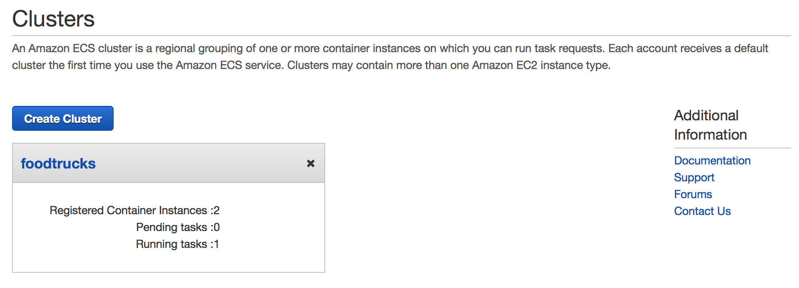

<a id="top"></a>


*Learn to build and deploy your distributed applications easily to the cloud with Docker*

Written and developed by [Prakhar Srivastav](http://prakhar.me) and [ADI](https://adicu.com/).

<a href="#top" class="top" id="getting-started">Top</a>

## Getting Started: FAQs

### What is Docker?
Wikipedia defines [Docker](https://www.docker.com/) as 

> an open-source project that automates the deployment of software applications inside **containers** by providing an additional layer of abstraction and automation of **OS-level virtualization** on Linux.

Wow! That's a mouthful. In simpler words, Docker is a tool that allows developers, sys-admins etc. to easily deploy their applications in a sandbox (called *containers*) to run on the host operating system i.e. Linux. The key benefit of Docker is that it allows users to **package an application with all of its dependencies into a standardized unit** for software development. Unlike virtual machines, containers do not have the high overhead and hence enable more efficient usage of the underlying system and resources.


### What are containers?

The industry standard today is to use Virtual Machines (VMs) to run software applications. VMs run applications inside a guest Operating System, which runs on virtual hardware powered by the server’s host OS.

VMs are great at providing full process isolation for applications: there are very few ways a problem in the host operating system can affect the software running in the guest operating system, and vice-versa. But this isolation comes at great cost — the computational overhead spent virtualizing hardware for a guest OS to use is substantial.

Containers take a different approach: by leveraging the low-level mechanics of the host operating system, containers provide most of the isolation of virtual machines at a fraction of the computing power.

### Why should I use it?

Docker's rise has been nothing short of meteoric. Although containers by themselves are not a new technology, it was not until docker arrived that they started to get mainstream attention. By providing standard APIs that made containers easy to use and creating a way for the community to collaborate around libraries of containers, Docker has radically changed the face of technology landscape. In an article published by [The Register](http://www.theregister.co.uk/2014/05/23/google_containerization_two_billion/) around 6 months ago, it is claimed that Google runs over **two billion containers per week**.

**Google Trends for 'Docker'**


Apart from that interest in Docker has been continuously growing and the company - Docker Inc itself valued at over a billion dollars! Due to its benefits of efficiency and portability, Docker has been gaining mindshare rapidly is now leading the **Containerization** movement. As a developer going out into the world, it is important that we understand this trend and see how we can benefit from it.

### What will this tutorial teach me?
This tutorial aims to be the one-stop shop for getting your hands dirty with Docker. Apart from demystifying the docker landscape, it'll give you hands-on experience with building and deploying your webapps on the Cloud. We'll be using [Amazon Web Services](http://aws.amazon.com) to deploy a static website and two dynamic webapps on [EC2](https://aws.amazon.com/ec2/) using [Elastic Beanstalk](https://aws.amazon.com/elasticbeanstalk/) and [Elastic Container Service](https://aws.amazon.com/ecs/). Even if you have no prior experience with deployments, this tutorial should be all you need to get started.

## Using this Document
This document contains a series of several sections, each of which explains a particular aspect of Docker. In each section, we will be typing commands (or writing code). All the code used in the tutorial is available in the [Github repo](http://github.com/prakhar1989/docker-curriculum).

<a href="#top" class="top" id="table-of-contents">Top</a>
## Table of Contents

-	[Preface](#preface)
    -	[Prerequisites](#prerequisites)
    -	[Setting up your computer](#setup)
-   [1.0 Playing with Busybox](#busybox)
    -   [1.1 Docker Run](#dockerrun)
    -   [1.2 Terminology](#terminology)
-   [2.0 Webapps with Docker](#webapps)
    -   [2.1 Static Sites](#static-site)
    -   [2.2 Docker Images](#docker-images)
    -   [2.3 Our First Image](#our-image)
    -   [2.4 Dockerfile](#dockerfiles)
    -   [2.5 Docker on AWS](#docker-aws)
-   [3.0 Multi-container Environments](#multi-container)
    -   [3.1 SF Food Trucks](#foodtrucks)
    -   [3.2 Docker Network](#docker-network)
    -   [3.3 Docker Compose](#docker-compose)
    -   [3.4 AWS Elastic Container Service](#aws-ecs)
-   [4.0 Wrap Up](#wrap-up)
    -   [4.1 What Next?](#next-steps)
    -   [4.2 Give Feedback](#feedback)
-   [References](#references)


------------------------------
<a href="#table-of-contents" class="top" id="preface">Top</a>
## Preface

> Note: This tutorial uses version **1.9.1** of Docker. If you find any part of the tutorial incompatible with a future version, please raise an [issue](https://github.com/prakhar1989/docker-curriculum/issues). Thanks!

<a id="prerequisites"></a>
### Prerequisites
There are no specific skills needed for this tutorial beyond a basic comfort with the command line and using a text editor. Prior experience in developing web applications would be helpful but not required. As we proceed further along the tutorial, we'll make use of a few cloud services. If you're interested in following along, please create an account on each of these websites - 

- [Amazon Web Services](http://aws.amazon.com/)
- [Docker Hub](https://hub.docker.com/)

<a id="setup"></a>
### Setting up your computer
Getting all the tooling setup on your computer can be a daunting task, but thankfully as Docker has become stable getting it up and running on your favorite OS has become very easy. At first, we'll install docker.

##### Docker 
Until a few releases ago, running docker on OSX and Windows was quite a hassle. Lately however, docker has invested significantly into improving the on-boarding experience for its users on these OSes and hence running Docker now is a cakewalk. The *getting started* guide on Docker has detailed instructions for setting up Docker on [Mac](http://docs.docker.com/mac/step_one/), [Linux](http://docs.docker.com/linux/step_one/) and [Windows](http://docs.docker.com/windows/step_one/).

Once you are done installing docker, test your docker installation by running the following
```
$ docker run hello-world

Hello from Docker.
This message shows that your installation appears to be working correctly.
...
```

##### Python
Python comes pre-installed on OSX and (most) Linux distributions. We'll also be using [pip](https://pip.readthedocs.org/en/stable/) for installing packages for our application.

If don't have pip installed, please [download](http://pip.readthedocs.org/en/stable/installing/) it for your system.

```
$ python --version
python --version
Python 2.7.10

$ pip --version
pip 7.1.2 from /Library/Python/2.7/site-packages/pip-7.1.2-py2.7.egg (python 2.7)
```

##### Java
The app that we'll be developing will be using [Elasticsearch](https://www.elastic.co/) for storage and search. In order to run elasticsearch locally, make sure you have Java installed. If Java is installed, typing `java -version` in your terminal should give you an output similar to the one below.

```
$ java -version
java version "1.8.0_60"
Java(TM) SE Runtime Environment (build 1.8.0_60-b27)
Java HotSpot(TM) 64-Bit Server VM (build 25.60-b23, mixed mode)
```
___________

<a href="#table-of-contents" class="top" id="preface">Top</a>
<a id="busybox"></a>
## 1.0 Playing with Busybox
Now that we have everything setup, it's time to get our hands dirty. In this section, we are going to run a [Busybox](https://en.wikipedia.org/wiki/BusyBox) (a lightweight linux distribution) container on our system and get a taste of the `docker run` command.

To get started, let's run the following in our terminal 
```
$ docker pull busybox
```

> Note: Depending on how you've installed docker on your system, you might see a `permission denied` error on running the above command. If you're on a Mac, make sure docker engine is running. If you're on Linux, then prefix your `docker` commands with `sudo`. Alternatively you can [create a docker group](http://docs.docker.com/engine/installation/ubuntulinux/#create-a-docker-group) to get rid of this issue.

What the `pull` command does is it fetches the busybox **image** from the **docker registry** and saves it in our system. You can use the `docker images` command to see a list of all images on your system.
```
$ docker images
REPOSITORY              TAG                 IMAGE ID            CREATED             VIRTUAL SIZE
busybox                 latest              c51f86c28340        4 weeks ago         1.109 MB
```

<a id="dockerrun"></a>
### 1.1 Docker Run
Great! Lets now lets run a docker **container** based on this image. To do that we are going to use the almighty `docker run` command. 

```
$ docker run busybox
$
```
Wait, nothing happened! Is that a bug? Well, no. Behind the scenes, a lot of stuff happened. When you call `run`, the docker client finds the image (busybox in this case) loads up the container and then runs a command in that container. When we run `docker run busybox`, we didn't provide a command so the container booted up, ran an empty command and then exited. 
Well, yeah - kind of a bummer. Let's try something more exciting.

```
$ docker run busybox echo "hello from busybox"
hello from busybox
```
Nice - finally we see some output. In this case, the docker client dutifully ran the `echo` command in our busybox container and then exited it. If you've noticed, all of that happened pretty quickly. Imagine booting up a virtual machine, running a command and then killing it. Now you know why they say containers are fast! Ok, now it's time to see the `docker ps` command. The `docker ps` command tells you what all containers are currently running.

```
$ docker ps
CONTAINER ID        IMAGE               COMMAND             CREATED             STATUS              PORTS               NAMES
```
Since no containers are running, we see a blank line. Let's try a more useful variant - `docker ps -a` 
```
$ docker ps -a
CONTAINER ID        IMAGE               COMMAND             CREATED             STATUS                      PORTS               NAMES
305297d7a235        busybox             "uptime"            11 minutes ago      Exited (0) 11 minutes ago                       distracted_goldstine
ff0a5c3750b9        busybox             "sh"                12 minutes ago      Exited (0) 12 minutes ago                       elated_ramanujan
```
So what we see above is a list of all containers that we ran. Do notice that the `STATUS` column shows that these containers exited a few minutes ago. You're probably wondering that if there's a way to run more than just one command in a container. Let's try that now
```
$ docker run -it busybox sh
/ # ls
bin   dev   etc   home  proc  root  sys   tmp   usr   var
/ # uptime
 05:45:21 up  5:58,  0 users,  load average: 0.00, 0.01, 0.04
```
Running the `run` command with the `-it` flags attaches us to an interactive tty in the container. Now we can run as many commands in the container as we want. Take some time to run your favorite commands. 

> **Danger Zone**: If you're feeling particularly adventureous you can try `rm -rf bin` in the container. Make sure you run this command in the container and **not** in your laptop. Doing this will not make any other commands like `ls`, `echo` work. Once everything stop working you can exit the container and then run it back up again with the `docker run -it busybox sh` command. Since docker creates a new container everytime, everything should start working back again.

That concludes a whirlwind tour of the mighty `docker run` command which would most likely be the command you'll use most often. It makes sense to spend some time getting comfortable with it. To find out more about `run`, use `docker run --help` to see a list of all flags it supports. As we proceed further, we'll see a few more variants of `docker run`.

<a id="terminology"></a>
### 1.2 Terminology
In the last section, we used a lot of docker-specific jargon which might be confusing to some. So before we go further, let me clarify some terminology that is used frequently in the docker ecosystem.

- *Images* - The blueprints of our application which form the basis of containers. In the demo above, we used the `docker pull` command to download the **busybox** image.
- *Containers* - Created from docker images and run the actual application. We create a container using `docker run` which we did using the busybox image that we downloaded. The list of running containers can be seen using the `docker ps` command.
- *Docker Daemon* - The background service running on the host that manages building, running and distributing docker containers. The daemon is the process that runs in the operation system to which clients talk to.
- *Docker Client* - The command line tool that allows the user to interact with the daemon. More generally, there can be other forms of clients too - such as [Kitematic](https://kitematic.com/) which provide a GUI to the users.
- *Docker hub* - A [registry](https://hub.docker.com/explore/) of docker images. You can think of the registry as a directory of all available docker images. If required, one can host their own docker registries and can use them for pulling images.

<a href="#table-of-contents" class="top" id="preface">Top</a>
<a id="webapps"></a>
## 2.0 Webapps with Docker
Great! So we have now looked at `docker run`, played with a docker container and also got a hang of some terminology. Armed with all this knowledge, we are now ready to get to the real-stuff i.e. deploying web applications with docker!

<a id="static-site"></a>
### 2.1 Static Sites
Let's start by taking baby-steps. The first thing we're going to look at is how we can run a dead-simple static website. We're going to pull a docker image from the docker hub, running the container and see how easy it so to run a webserver. 

Let's begin. The image that we are going to use is a single-page [website](http://github.com/prakhar1989/docker-curriculum) that I've already created for the purposes of this demo and hosted it on the [registry](https://hub.docker.com/r/prakhar1989/static-site/) - `prakhar1989/static-site`. We can download and run the image directly in one go using `docker run`.

```
$ docker run prakhar1989/static-site
```
Since the image doesn't exist locally, the client will first fetch the image from the registry and then run the image. If all goes well, you should see a `Nginx is running...` message in your terminal. Okay now that the server is running, how do see the website? What port is it running on? And more importantly, how do we access the container directly from our host machine?

Well in this case, the client is not exposing any ports so we need to re-run the `docker run` command to publish ports. While were at it, we should also find a way so that our terminal is not attached to the running container. So that you can happily close your terminal and keep the container running. This is called the **detached** mode.

```
$ docker run -d -P --name static-site prakhar1989/static-site
e61d12292d69556eabe2a44c16cbd54486b2527e2ce4f95438e504afb7b02810
```

In the above command, `-d` will detach our terminal, `-P` will publish all exposed ports to random ports and finally `--name` corresponds to a name we want to give. Now we can see the ports by running the `docker port` command

```
$ docker port static-site
443/tcp -> 0.0.0.0:32772
80/tcp -> 0.0.0.0:32773
```

If you're on Linux, you can open [http://localhost:32772](http://localhost:32772) in your browser. If you're on Windows or a Mac, you need to find the IP of the hostname.

```
$ docker-machine ip default
192.168.99.100
```
You can now open [http://192.168.99.100:32772](http://192.168.99.100:32772) to see your site live! You can also specify a custom port to which the client will forward connections to the container. 

```
$ docker run -p 8888:80 prakhar1989/static-site
Nginx is running...
```


I'm sure you agree that was super simple. To deploy this on a real server you would just need to install docker, and run the above docker command. 

Now that you've seen how to run a webserver inside a docker image, you must be wondering - how do I create my own docker image? This is the question we'll be exploring in the next section.

<a id="docker-images"></a>
### 2.2 Docker Images

We've looked at images before but in this section we'll dive deeper into what docker images are and build our own image! Lastly, we'll also use that image to run our application locally and finally deploy on [AWS](http://aws.amazon.com) to share it with our friends! Excited? Great! Let's get started.

Docker images are the basis of containers. In the previous example, we **pulled** the *Busybox* image from the registry and asked the docker client to run a container **based** on that image. To see the list of images that are available locally, use the `docker images` command.

```
$ docker images
REPOSITORY                      TAG                 IMAGE ID            CREATED             VIRTUAL SIZE
prakhar1989/catnip              latest              c7ffb5626a50        2 hours ago         697.9 MB
prakhar1989/static-site         latest              b270625a1631        21 hours ago        133.9 MB
python                          3-onbuild           cf4002b2c383        5 days ago          688.8 MB
martin/docker-cleanup-volumes   latest              b42990daaca2        7 weeks ago         22.14 MB
ubuntu                          latest              e9ae3c220b23        7 weeks ago         187.9 MB
busybox                         latest              c51f86c28340        9 weeks ago         1.109 MB
hello-world                     latest              0a6ba66e537a        11 weeks ago        960 B
```

The above gives a list of images that I've pulled from the registry and the ones that I've created myself (we'll shortly see how). The `TAG` refers to a particular snapshot of the image and the `ID` is the corresponding unique identifier for that image. 

For simplicity, you can think of an image akin to a git repository - images can be [committed](https://docs.docker.com/engine/reference/commandline/commit/) with changes and have multiple versions. When you provide a specific version number, the client defaults to `latest`. For example, you can pull a specific version of `ubuntu` image
```
$ docker pull ubuntu:12.04
```

To get a new Docker image you can either get it from a registry (such as the docker hub) or create your own. There are tens of thousands of images available on [Docker hub](https://hub.docker.com). You can also search for images directly from the command line using `docker search`. 

An important distinction to be aware of when it comes to images is between base and user images. 

- **Base images** are images that officially maintained and supported by the folks at Docker. These are typically one word long. In the list of images above, the `python`, `ubuntu`, `busybox` and `hello-world` images are base images. 
- **User images** are images created and shared by users like you and me. They build on base images and add additional functionality. Typically these are formatted as `user/image-name`.

<a id="our-image"></a>
### 2.3 Our First Image

Now that we have a better understanding of images, it's time to create our own. Our goal in this section will be to create an image that sandboxes a simple [Flask](http://flask.pocoo.org) application. For the purposes of this workshop, I've already created a fun, little [Flask app](https://github.com/prakhar1989/docker-curriculum/tree/master/flask-app) that displays a random cat `.gif` every time it is loaded - because you know, who doesn't like cats? If you haven't already, please go ahead the clone the repository locally.

Before we get started on creating the image, let's first test that the application works correctly locally. Step one is to `cd` into the `flask-app` directory and install the dependencies
```
$ cd flask-app
$ pip install -r requirements.txt
$ python app.py
 * Running on http://0.0.0.0:5000/ (Press CTRL+C to quit)
```
If all goes well, you should see the output as above. Head over to [http://localhost:5000](http://localhost:5000) to see the app in action.

> Note: If `pip install` is giving you permission denied errors, you might need to try running the command as `sudo`.

Looks great doesn't it? The next step now is to create an image with this web app. As mentioned above, all user images are based off a base image. Since our application is written in Python, the base image we're going to use will be [Python 3](https://hub.docker.com/_/python/). More specifically, we are going to use the `python:3-onbuild` version of the python image. 

What's the `onbuild` version you might ask?

> These images include multiple ONBUILD triggers, which should be all you need to bootstrap most applications. The build will COPY a `requirements.txt` file, RUN `pip install` on said file, and then copy the current directory into `/usr/src/app`.

In other words, the `onbuild` version of the image includes helpers that automate the boring parts of getting an app running. Rather than doing these tasks manually (or scripting these tasks), these images do that work for you. We now have all the ingredients to create our own image - a functioning web app and a base image. How are we going to do that? The answer is - using a **Dockerfile**.

<a id="dockerfiles"></a>
### 2.4 Dockerfile

A [Dockerfile](https://docs.docker.com/engine/reference/builder/) is a simple text-file that contains a list of commands that the docker client calls while creating an image. It is simple way to automate the image creation process. The best part is that the [commands](https://docs.docker.com/engine/reference/builder/#from) you write in a Dockerfile are *almost* identical to their equivalent Linux commands. This means you don't really have to learn new syntax to create your own dockerfiles.

The application directory does contain a Dockerfile but since we're doing this for the first time, we'll create one from scratch. To start, create a new blank file in our favorite text-editor and save it in the **same** folder as the flask app by the name of `Dockerfile`.

We start with specifying our base image. Use the `FROM` keyword to do that - 
```
FROM python:3-onbuild
```
The next step usually is to write the commands of copying the files and installing the dependencies. Luckily for us, the `onbuild` version of the image takes care of that. The next thing, we need to the tell is the port number which needs to be exposed. Since our flask app is running on `5000` that's what we'll indicate.
```
EXPOSE 5000
```
The last step is simply to write the command for running the application which is simply - `python ./app.py`. We use the [CMD](https://docs.docker.com/engine/reference/builder/#cmd) command to do that - 
```
CMD ["python", "./app.py"]
```

The primary purpose of `CMD` is to tell the container which command it should run when it is started. With that, our `Dockerfile` is now ready. This is how it looks like -
```
# our base image
FROM python:3-onbuild

# tell the port number the container should expose
EXPOSE 5000

# run the application
CMD ["python", "./app.py"]
```

Now that we finally have our `Dockerfile`, we can now build our image. The `docker build` command does the heavy-lifting of creating a docker image from a `Dockerfile`.

Let's run the following -
```
$ docker build -t prakhar1989/catnip .
Sending build context to Docker daemon 8.704 kB
Step 1 : FROM python:3-onbuild
# Executing 3 build triggers...
Step 1 : COPY requirements.txt /usr/src/app/
 ---> Using cache
Step 1 : RUN pip install --no-cache-dir -r requirements.txt
 ---> Using cache
Step 1 : COPY . /usr/src/app
 ---> 1d61f639ef9e
Removing intermediate container 4de6ddf5528c
Step 2 : EXPOSE 5000
 ---> Running in 12cfcf6d67ee
 ---> f423c2f179d1
Removing intermediate container 12cfcf6d67ee
Step 3 : CMD python ./app.py
 ---> Running in f01401a5ace9
 ---> 13e87ed1fbc2
Removing intermediate container f01401a5ace9
Successfully built 13e87ed1fbc2
```
While running the command yourself, make sure to replace my username with yours. This username should be the same on you created when you registered on [Docker hub](https://hub.docker.com). If you haven't done that yet, please go ahead and create an account. The `docker build` command is quite simple - it takes an optional tag name with `-t` and a location of the directory containing the `Dockerfile`.


If you don't have the `python-3:onbuild` image, the client will first pull the image and then create your image. Hence, your output on running the command will look different from mine. See carefully and you'll notice that the on-build triggers were executed correctly. If everything went well, your image should be ready! Run `docker images` and see if your image shows. 

The last step in this section is to run the image and see if it actually works. 
```
$ docker run -p 8888:5000 prakhar1989/catnip
 * Running on http://0.0.0.0:5000/ (Press CTRL+C to quit)
```
Head over to the URL above and your app should be live. 


Congratulations! You have successfully created your first docker image.

<a id="docker-aws"></a>
### 2.5 Docker on AWS

What good is an application that can't be shared with friends, right? So in this section we are going to see how we will deploy our awesome application on the cloud so that we can share it with our friends! We're going to use AWS [Elastic Beanstalk](https://aws.amazon.com/elasticbeanstalk/) to get our application up and running in a few clicks. We'll also see how easy it is to make our application scalable and manageable with Beanstalk!

##### Docker push
The first thing that we need to do before we go ahead and deploy our app on AWS is to publish our image on a registry which can be accessed by AWS. There are many different [docker registries](https://aws.amazon.com/ecr/) you can use (you can even host [your own](https://docs.docker.com/registry/deploying/)). For now, let's use [Docker hub](https://hub.docker.com) to publish the image. To publish, just type 
```
$ docker push prakhar1989/catnip
```
Remember to replace the name of the image tag above with yours. It is important to have the format of `username/image_name` so that the client knows where to publish. If this is the first time you are pushing an image, the client will ask you to login. Provide the same credentials that you used for logging into docker hub.

Once that is done, you can view your image on the hub. For example, here's the [web page](https://hub.docker.com/r/prakhar1989/catnip/) for my image.

> Note: One thing that I'd like to clarify before we go ahead is that it is not **imperative** to host your image on a public registry (or any registry) in order to deploy on AWS. In case you're writing code for the next million-dollar unicorn startup you can totally skip this step. The reason why we're pushing our images publicly is that it makes super simple to do deployment by skipping a few intermediate configuration steps.

Now that your image is online, anyone who has docker installed can play with your app by typing just a single command. 
```
$ docker run -p 8888:5000 prakhar1989/catnip
```
If you've pulled your hair in setting up local dev environments / sharing application configuration in the past, you very well know how awesome this sounds. That's why Docker is so cool!


##### Beanstalk
AWS Elastic Beanstalk (EB) is a PaaS (Platform as a Service) offered by AWS. If you've used Heroku, Google App Engine etc. you'll feel right at home. As a developer, you just tell EB how to run your app and it takes care of the rest - including scaling, monitoring and even updates. In April 2014, EB added in support for running single-container Docker deployments which is what we'll use to deploy our app. Although EB has a very intuitive [CLI](http://docs.aws.amazon.com/elasticbeanstalk/latest/dg/eb-cli3.html), it does require some setup and to keep things simple we'll use the web UI to launch our application.

To follow along, you need a functioning [AWS](http://aws.amazon.com) account. If you haven't already, please go ahead and do that now - you will need to enter your credit card information. Don't worry, it's free and anything we do in this tutorial will also be free! Let's get started.

Here are the steps -

- Login to your AWS [console](http://console.aws.amazon.com).
- Click on Elastic Beanstalk. It will be in the compute section on the top left. Alternatively, just click [here](https://console.aws.amazon.com/elasticbeanstalk) to access the EB console.


- Click on "Create new application"
- Give your app a memorable (but unique) name and provide an (optional) description
- In the **New Environment** screen, choose the **Web Server Environment**.
- The following screen is shown below. Choose *Docker* from the predefined configuration. You can leave the *Environment type* as it is. Click Next.


- This is where we need to tell EB about our image. Open the `Dockerrun.aws.json` [file](https://github.com/prakhar1989/docker-curriculum/blob/master/flask-app/Dockerrun.aws.json) located in the `flask-app` folder and edit the `Name` of the image to your image's name. Don't worry, I'll explain the contents of the file shortly. When you are done, click on the radio button for "upload your own" and upload this file.
- Next up, choose an environment name and a URL. This URL is what you'll share with your friends so make sure it's easy to remember.
- For now, we won't be making changes in the *Additional Resources* section. Click Next and move to *Configuration Details*.
- In this section, all you need to do is to check that the instance type is `t1.micro`. This is very important as this is the **free** instance by AWS. You can optionally choose a key-pair to login. If you don't know what that means, feel free to ignore this for now. We'll leave everything else to the default and forge ahead.
- We also don't need to provide any *Environment Tags* and *Permissions* so without batting an eyelid, you can click Next twice in succession. At the end, the screen shows us *Review* page. If everything looks good, go ahead and press the **Launch** button.
- The final screen that you see will have a few spinners indicating that your environment is setting up. It typically takes around 5mins for first-time setup.

While we wait, let's quickly see what the `Dockerrun.aws.json` file contains. This file is basically an AWS specific file that tells EB details about our application and docker configuration.

```
{
  "AWSEBDockerrunVersion": "1",
  "Image": {
    "Name": "prakhar1989/catnip",
    "Update": "true"
  },
  "Ports": [
    {
      "ContainerPort": "5000"
    }
  ],
  "Logging": "/var/log/nginx"
}
```
The file should be pretty self-explanatory and the [reference](http://docs.aws.amazon.com/elasticbeanstalk/latest/dg/create_deploy_docker_image.html#create_deploy_docker_image_dockerrun) can be found in the official documentation. We provide the name of the image that EB should use a port that the container should expose.

Hopefully by now, our instance should be ready. Head over to EB page and you should a green tick indicating that your app is alive and kicking. 


Go ahead and open the URL in your browser and you should see the application in all its glory. Feel free to email / IM / snapchat this link to your friends and family so that they can enjoy a few cat gifs too.

Congratulations! You have deployed your first Docker application! That might seem a series of steps but with the command-line tool for EB you can almost mimic the functionality of Heroku in a few keystrokes! Hopefully you agree that Docker takes away a lot of pains of building and deploying applications in the cloud. I would encourage you to read the AWS [documentation](http://docs.aws.amazon.com/elasticbeanstalk/latest/dg/docker-singlecontainer-deploy.html) on single-container docker environments to get an idea of what all features exist.

In the next (and final) part of the tutorial we'll up the ante a bit and deploy an application that mimics the real-world more closely - a app with a persistent back-end storage tier! Let's get straight to it.

<a href="#table-of-contents" class="top" id="preface">Top</a>
<a id="multi-container"></a>
## Multi-container Environments
In the last section, we saw how easy and fun it is to run applications with Docker. We started with a simple static website and then tried a Flask app both of which we could run locally and on the cloud with just a few commands. One thing both these apps had in common where that they were running in a **single container**. 

Those of you who have experience running services in production, know that usually apps nowadays are not that simple. There's almost always a database (or any other kind of persistent storage) involved. Systems such as [Redis](http://redis.io/) and [Memcached](http://memcached.org/) have become the *de riguer* of most web applications architectures. Hence, in this section we going to spend some time learning how to Dockerize applications which rely on different services to run.

In particular we are going to see how we can run and manage **multi-container** docker environments. Why multi-container you might ask? Well, one of the key plus points of Docker is the way it provides isolation. The idea of bundling a process with its dependencies in a sandbox (called containers) is what makes this so powerful.

Just like it's a good strategy to decouple your application tiers, it is wise to keep containers for each of the **services** separate. Each tier is likely to have different resource needs and those needs might grow at different rates. By separating the tiers into different containers, we can compose each tier using the most appropriate instance type based on different resource needs. This also plays in very well with the whole [microservices](http://martinfowler.com/articles/microservices.html) movement which is one of the main reasons why Docker (or any other container technology) is at the [forefront](https://medium.com/aws-activate-startup-blog/using-containers-to-build-a-microservices-architecture-6e1b8bacb7d1#.xl3wryr5z) of modern microservices architectures.

<a id="foodtrucks"></a>
### 3.1 SF Food Trucks

The app that we're going to Dockerize is called [SF Food Trucks](http://sf-foodtrucks.xyz). My goal in building this app was to have something that is useful (in that it resembles a real-world application), relies on at least one service but is not too complex for the purpose of this tutorial. This is what I came up with -


The app's backend is written in Python (Flask) and for search it uses [Elasticsearch](https://www.elastic.co/products/elasticsearch). Like everything else in this tutorial, the entire source is available on [Github](http://github.com/prakhar1989/FoodTrucks). We'll use this as our candidate application for learning out how to build, run and deploy a multi-container environment.

Now that you're excited (hopefully), let's think how of we can Dockerize the app. We can see that the application consists of a Flask backend server and an Elasticsearch service. A natural way to split this app would be to have two containers - one running the Flask process and another running the Elasticsearch (ES) process. That way if our app becomes popular, we can scale it by adding more containers depending on where the bottleneck lies.

Great so we need two containers. That shouldn't be hard right? We've already built our own Flask container in the previous section. And for Elasticsearch, let's see if we can find something on the hub.

```
$ docker search elasticsearch
NAME                              DESCRIPTION                                     STARS     OFFICIAL   AUTOMATED
elasticsearch                     Elasticsearch is a powerful open source se...   697       [OK]
itzg/elasticsearch                Provides an easily configurable Elasticsea...   17                   [OK]
tutum/elasticsearch               Elasticsearch image - listens in port 9200.     15                   [OK]
barnybug/elasticsearch            Latest Elasticsearch 1.7.2 and previous re...   15                   [OK]
digitalwonderland/elasticsearch   Latest Elasticsearch with Marvel & Kibana       12                   [OK]
monsantoco/elasticsearch          ElasticSearch Docker image                      9                    [OK]
```

Quite unsurprisingly, there exists an officially supported [image](https://hub.docker.com/_/elasticsearch/) for Elasticsearch. To get ES running, we can simply use `docker run` and have a single-node ES container running locally within no time.
```
$ docker run -dp 9200:9200 elasticsearch
d582e031a005f41eea704cdc6b21e62e7a8a42021297ce7ce123b945ae3d3763

$ docker-machine ip default
192.168.99.100

$ curl 192.168.99.100:9200
{
  "name" : "Ultra-Marine",
  "cluster_name" : "elasticsearch",
  "version" : {
    "number" : "2.1.1",
    "build_hash" : "40e2c53a6b6c2972b3d13846e450e66f4375bd71",
    "build_timestamp" : "2015-12-15T13:05:55Z",
    "build_snapshot" : false,
    "lucene_version" : "5.3.1"
  },
  "tagline" : "You Know, for Search"
}
```
While we are at it, let's get our Flask container running too. But before we get to that, we need a `Dockerfile`. In the last section, we used `python:3-onbuild` image as our base image. This time, however, apart from installing Python dependencies via `pip` we want our application to also generate our [minified Javascript file](http://sf-foodtrucks.xyz/static/build/main.js) for production. For this, we'll require Nodejs. Since we need a custom build step, we'll start from the `ubuntu` base image build our `Dockerfile` from scratch. 

> Note: if you find that an existing image doesn't cater to your needs, feel free to start from another base image and tweak it yourself. For most of the images on Docker Hub, you should be able to find the corresponding `Dockerfile` on Github. Reading through existing Dockerfiles is one of the best ways to learn how to roll your own.


Our [Dockerfile](https://github.com/prakhar1989/FoodTrucks/blob/master/Dockerfile) for the flask app looks like below - 
```
# start from base
FROM ubuntu:14.04
MAINTAINER Prakhar Srivastav <prakhar@prakhar.me>

# install system-wide deps for python and node
RUN apt-get -yqq update
RUN apt-get -yqq install python-pip python-dev
RUN apt-get -yqq install nodejs npm
RUN ln -s /usr/bin/nodejs /usr/bin/node

# copy our application code
ADD flask-app /opt/flask-app
WORKDIR /opt/flask-app

# fetch app specific deps
RUN npm install
RUN npm run build
RUN pip install -r requirements.txt

# expose port
EXPOSE 5000

# start app
CMD [ "python", "./app.py" ]
```
Quite a few new things here so let's quickly go over this file. We start off with the [Ubuntu LTS](https://wiki.ubuntu.com/LTS) base image and use the package manager `apt-get` to install the dependencies namely - Python and Node. The `yqq` flag is used to suppress output and assumes "Yes" to all prompt. We also create a symbolic link for the node binary to deal with backward compatibility issues.

We then use the `ADD` command to copy our application into a new volume in the container - `/opt/flask-app`. This is where our code will reside. We also set this as our working directory so that the following commands running in the context of this location. Now that our system-wide dependencies are installed, we get around to install app-specific ones. First off, we tackle node, install the packages from npm and run the build command as defined in our `package.json` [file](https://github.com/prakhar1989/FoodTrucks/blob/master/flask-app/package.json#L7-L9). We finish the file off by installing the Python packages, exposing the port and defining the `CMD` to run as we did in the last section.

Finally, we can now go ahead, build the image and the run the container (replace `prakhar1989` with your username below). 
```
$ docker build -t prakhar1989/foodtrucks-web .
```
In the first run, this will take time as the Docker client will download the ubuntu image, run all the commands and prepare your image. Re-running `docker build` after any subsequent changes that you make to the application code will almost be instantaneous. Now let's try running our app.
```
$ docker run -P prakhar1989/foodtrucks-web
Unable to connect to ES. Retying in 5 secs...
Unable to connect to ES. Retying in 5 secs...
Unable to connect to ES. Retying in 5 secs...
Out of retries. Bailing out...
```
Oops! Our flask app was unable to run since it was unable to connect to Elasticsearch. How do we tell one container about the other container and get them to talk to each other? The answer lies in the next section.

<a id="docker-network"></a>
### 3.2 Docker Network
Before we talk about the features Docker provides especially to deal with such scenarios, let's see if we can figure out a way to get around the problem. Hopefully this should give you an appreciation for the specific feature that we are going to study.

Okay, so let's run `docker ps` and see what we have.
```
$ docker ps
CONTAINER ID        IMAGE               COMMAND                  CREATED             STATUS              PORTS                              NAMES
e931ab24dedc        elasticsearch       "/docker-entrypoint.s"   2 seconds ago       Up 2 seconds        0.0.0.0:9200->9200/tcp, 9300/tcp   cocky_spence
```
So we have one ES container running on `0.0.0.0:9200` port which we can directly access. If we can tell our Flask app this connection URL, it should be able to connect and talk to ES, right? Let's dig into our [Python code](https://github.com/prakhar1989/FoodTrucks/blob/master/flask-app/app.py#L7) and see how the connection details are defined. 
```
es = Elasticsearch(host='es')
```
To make this work, we need to tell the Flask container that the ES container is running on `0.0.0.0` host (the port by default is `9200`) and that should make it work, right? Unfortunately that is not correct since the IP `0.0.0.0` is the IP to access ES container from the **host machine** i.e. from my Mac. Another container will not be able to access this on the same IP address. Okay if not that IP, then which IP address should the ES container be accessible by? I'm glad you asked this question.

Now is a good time to start our exploration of networking in Docker. When docker is installed, it creates three networks automatically.

```
$ docker network ls
NETWORK ID          NAME                DRIVER
075b9f628ccc        none                null
be0f7178486c        host                host
8022115322ec        bridge              bridge
```
The **bridge** network is the network in which containers are run by default. So that means that when I ran the ES container, it was running in this bridge network. To validate this, let's inspect the network

```
$ docker network inspect bridge
[
    {
        "Name": "bridge",
        "Id": "8022115322ec80613421b0282e7ee158ec41e16f565a3e86fa53496105deb2d7",
        "Scope": "local",
        "Driver": "bridge",
        "IPAM": {
            "Driver": "default",
            "Config": [
                {
                    "Subnet": "172.17.0.0/16"
                }
            ]
        },
        "Containers": {
            "e931ab24dedc1640cddf6286d08f115a83897c88223058305460d7bd793c1947": {
                "EndpointID": "66965e83bf7171daeb8652b39590b1f8c23d066ded16522daeb0128c9c25c189",
                "MacAddress": "02:42:ac:11:00:02",
                "IPv4Address": "172.17.0.2/16",
                "IPv6Address": ""
            }
        },
        "Options": {
            "com.docker.network.bridge.default_bridge": "true",
            "com.docker.network.bridge.enable_icc": "true",
            "com.docker.network.bridge.enable_ip_masquerade": "true",
            "com.docker.network.bridge.host_binding_ipv4": "0.0.0.0",
            "com.docker.network.bridge.name": "docker0",
            "com.docker.network.driver.mtu": "1500"
        }
    }
]
```

You can see that our container `e931ab24dedc` is listed under the `Containers` section in the output. What we also see is the IP address this container has been allotted - `172.17.0.2`. Is this the IP address that we're looking for? Let's find out by running our flask container and trying to access this IP.

```javascript
$ docker run -it --rm prakhar1989/foodtrucks-web bash
root@35180ccc206a:/opt/flask-app# curl 172.17.0.2:9200
bash: curl: command not found
root@35180ccc206a:/opt/flask-app# apt-get -yqq install curl
root@35180ccc206a:/opt/flask-app# curl 172.17.0.2:9200
{
  "name" : "Jane Foster",
  "cluster_name" : "elasticsearch",
  "version" : {
    "number" : "2.1.1",
    "build_hash" : "40e2c53a6b6c2972b3d13846e450e66f4375bd71",
    "build_timestamp" : "2015-12-15T13:05:55Z",
    "build_snapshot" : false,
    "lucene_version" : "5.3.1"
  },
  "tagline" : "You Know, for Search"
}
root@35180ccc206a:/opt/flask-app# exit
```
This should be fairly straightforward to you by now. We start the container in the interactive mode with the `bash` process. The `--rm` is a convenient flag for running one off commands as the container gets cleaned up when it's work is done. We try a `curl` but we need to install it first. Once we do that, we see that we can indeed talk to ES on `172.17.0.2:9200`. Awesome!

Although we have figured out a way to make the containers talk to each other, there are still two problems with this approach - 

1. We would need to a add an entry into the `/etc/hosts` file of the Flask container so that it knows that `es` hostname stands for `172.17.0.2`. If the IP keeps changing, manually editing this entry is quite tedious.

2. Since the *bridge* network is shared by every container by default this method is **not secure**.

The good news that docker has a great solution to this problem. It allows us to define our own networks and keeps it isolated. It also tackles the `/etc/hosts` problem and we'll quickly see how.

Let's first go ahead and create our own network.
```raw
$ docker network create foodtrucks
1a3386375797001999732cb4c4e97b88172d983b08cd0addfcb161eed0c18d89

$ docker network ls
NETWORK ID          NAME                DRIVER
1a3386375797        foodtrucks          bridge
8022115322ec        bridge              bridge
075b9f628ccc        none                null
be0f7178486c        host                host
```
The `network create` command creates a new *bridge* network - which is what we need at the moment. There are other [kinds](https://docs.docker.com/engine/userguide/networking/dockernetworks/) of networks that you can create and you are encouraged to read about them in the official docs. 

Now that we have a network, we can launch our containers inside this network using the `--net` flag. Let's do that - but first, we will stop our ES container that is running in the bridge (default) network.

```
$ docker ps 
CONTAINER ID        IMAGE               COMMAND                  CREATED             STATUS              PORTS                              NAMES
e931ab24dedc        elasticsearch       "/docker-entrypoint.s"   4 hours ago         Up 4 hours          0.0.0.0:9200->9200/tcp, 9300/tcp   cocky_spence

$ docker stop e931ab24dedc
e931ab24dedc

$ docker run -dp 9200:9200 --net foodtrucks --name es elasticsearch
2c0b96f9b8030f038e40abea44c2d17b0a8edda1354a08166c33e6d351d0c651

$ docker network inspect foodtrucks
[
    {
        "Name": "foodtrucks",
        "Id": "1a3386375797001999732cb4c4e97b88172d983b08cd0addfcb161eed0c18d89",
        "Scope": "local",
        "Driver": "bridge",
        "IPAM": {
            "Driver": "default",
            "Config": [
                {}
            ]
        },
        "Containers": {
            "2c0b96f9b8030f038e40abea44c2d17b0a8edda1354a08166c33e6d351d0c651": {
                "EndpointID": "15eabc7989ef78952fb577d0013243dae5199e8f5c55f1661606077d5b78e72a",
                "MacAddress": "02:42:ac:12:00:02",
                "IPv4Address": "172.18.0.2/16",
                "IPv6Address": ""
            }
        },
        "Options": {}
    }
]
```
We've done the same thing as did earlier but this time we gave our ES container a name `es`. Now before we and try to run our flask container, let's try to inspect what happens when we launch in a network.

```javascript
$ docker run -it --rm --net foodtrucks prakhar1989/foodtrucks-web bash
root@53af252b771a:/opt/flask-app# cat /etc/hosts
172.18.0.3	53af252b771a
127.0.0.1	localhost
::1	localhost ip6-localhost ip6-loopback
fe00::0	ip6-localnet
ff00::0	ip6-mcastprefix
ff02::1	ip6-allnodes
ff02::2	ip6-allrouters
172.18.0.2	es
172.18.0.2	es.foodtrucks

root@53af252b771a:/opt/flask-app# curl es:9200
bash: curl: command not found
root@53af252b771a:/opt/flask-app# apt-get -yqq install curl
root@53af252b771a:/opt/flask-app# curl es:9200
{
  "name" : "Doctor Leery",
  "cluster_name" : "elasticsearch",
  "version" : {
    "number" : "2.1.1",
    "build_hash" : "40e2c53a6b6c2972b3d13846e450e66f4375bd71",
    "build_timestamp" : "2015-12-15T13:05:55Z",
    "build_snapshot" : false,
    "lucene_version" : "5.3.1"
  },
  "tagline" : "You Know, for Search"
}
root@53af252b771a:/opt/flask-app# ls
app.py  node_modules  package.json  requirements.txt  static  templates  webpack.config.js
root@53af252b771a:/opt/flask-app# python app.py
Index not found...
Loading data in elasticsearch ...
Total trucks loaded:  733
 * Running on http://0.0.0.0:5000/ (Press CTRL+C to quit)
root@53af252b771a:/opt/flask-app# exit
```

Wohoo! That works! Magically docker made the correct host file entry in `/etc/hosts` which means that `es:9200` correctly resolves to the IP address of the ES container. Great! Let's launch our Flask container for real now - 
```javascript
$ docker run -d --net foodtrucks -p 5000:5000 --name foodtrucks-web prakhar1989/foodtrucks-web
2a1b77e066e646686f669bab4759ec1611db359362a031667cacbe45c3ddb413

$ docker ps
CONTAINER ID        IMAGE                        COMMAND                  CREATED             STATUS              PORTS                              NAMES
2a1b77e066e6        prakhar1989/foodtrucks-web   "python ./app.py"        2 seconds ago       Up 1 seconds        0.0.0.0:5000->5000/tcp             foodtrucks-web
2c0b96f9b803        elasticsearch                "/docker-entrypoint.s"   21 minutes ago      Up 21 minutes       0.0.0.0:9200->9200/tcp, 9300/tcp   es

$ docker-machine ip default
192.168.99.100

$ curl -I 192.168.99.100:5000
HTTP/1.0 200 OK
Content-Type: text/html; charset=utf-8
Content-Length: 3697
Server: Werkzeug/0.11.2 Python/2.7.6
Date: Sun, 10 Jan 2016 23:58:53 GMT
```

Head over to [http://192.168.99.100:5000](http://192.168.99.100:5000) and see your glorious app live! Although that might have seemed like a lot of work, we actually just typed 4 commands to go from zero to running. I've collated the commands in a [bash script](https://github.com/prakhar1989/FoodTrucks/blob/master/setup-docker.sh).
```
#!/bin/bash

# build the flask container
docker build -t prakhar1989/foodtrucks-web .

# create the network
docker network create foodtrucks

# start the ES container
docker run -d --net foodtrucks -p 9200:9200 -p 9300:9300 --name es elasticsearch

# start the flask app container
docker run -d --net foodtrucks -p 5000:5000 --name foodtrucks-web prakhar1989/foodtrucks-web
```

Now imagine you are distributing your app to a friend or running on a server that has docker installed, you can get a whole app running with just command!

```javascript
$ git clone https://github.com/prakhar1989/FoodTrucks
$ cd FoodTrucks
$ ./setup-docker.sh
```
And that's it! If you ask me, I find this to be an extremely awesome and powerful of sharing and running your applications!

<a id="docker-compose"></a>
### 3.3 Docker Compose

Till now we've spent all our time in exploring the docker client. In the docker ecosystem, however, there are a bunch of other open-source tools which play very nicely with Docker. Few of them are -

1. [Docker Machine](https://docs.docker.com/machine/) - Create Docker hosts on your computer, on cloud providers, and inside your own data center
2. [Docker Compose](https://docs.docker.com/compose/) - A tool for defining and running multi-container Docker applications. 
3. [Docker Swarm](https://docs.docker.com/swarm/) - A native clustering solution for Docker

In this section, we are going to look at one of these tools - Docker Compose and see how it can make dealing with multi-container apps easier.

The background story of Docker compose is quite interesting. Roughly two years ago, a company called OrchardUp launched a tool called Fig the idea behind which was to make the isolated development environments with Docker.The project was very well received on [Hacker News](https://news.ycombinator.com/item?id=7132044) - I oddly remember reading about it but didn't quite get the hang of it.

The [first comment](https://news.ycombinator.com/item?id=7133449) on the forum actually does a good job of explaining what Fig is all about.

> So really at this point, that's what Docker is about: running processes. Now Docker offers a quite rich API to run the processes: shared volumes (directories) between containers (i.e. running images), forward port from the host to the container, display logs, and so on.  But that's it: Docker as of now, remains at the process level. 

> While it provides options to orchestrate multiple containers to create a single "app", it doesn't address the managemement of such group of containers as a single entity.
And that's where tools such as Fig come in: talking about a group of containers as a single entity. Think "run an app" (i.e. "run an orchestrated cluster of containers") instead of "run a container".

It turns out, a lot of people using docker agree with this sentiment. Slowly and steadily as Fig became popular, Docker Inc. took notice, acquired the company and re-branded Fig as Docker Compose.

So what is *Compose* used for? Compose is a tool that is used for defining and running multi-container Docker apps in an easy way. It provides a configuration file called `docker-compose.yml` that can be used to bring up an application and the suite of service it depends on with just one command.

Let's see if we can create a `docker-compose.yml` file for our SF-Foodtrucks app and evaluate whether Docker Compose lives up to its promise.

The first step, however, is to install docker compose. If you're running Windows or a Mac and docker compose is already installed as it comes in the docker toolbox. Linux users can easily get their hands on Docker Compose by following the [instructions](https://docs.docker.com/compose/install/) on the docs. Since compose is written in Python, you can also simply do `pip install docker-compose`. Test your installation with -
```
$ docker-compose version
docker-compose version 1.5.2, build 7240ff3
docker-py version: 1.5.0
CPython version: 2.7.9
OpenSSL version: OpenSSL 1.0.1j 15 Oct 2014
```

Now that we have it installed, we can jump on the next step i.e. the docker compose file `docker-compose.yml`. The syntax for the `yml` is quite simple and the repo already contains the docker-compose [file](https://github.com/prakhar1989/FoodTrucks/blob/master/docker-compose.yml) that we'll be using.
```
es:
  image: elasticsearch
web:
  image: prakhar1989/foodtrucks-web
  command: python app.py
  ports:
    - "5000:5000"
  volumes:
    - .:/code
  links:
    - es
```
Let me breakdown what the file above means. At the parent level, we define the names of our services - `es` and `web`. For each service, that docker needs to run, we can additional parameters out of which `image` is required. For `es`, we just refer to the `elasticsearch` image available on the Docker hub. For our flask app, we refer to the image that we built at the beginning of this section. 

Via other parameters such as `command` and `ports` we provide more information about the container. The `volumes` parameter specifies a mount point in our `web` container where the code will reside. This is purely optional and is useful if you need access to logs etc. The `links` is the most important part where we specify that this container needs to be linked to the `es` container. This ensures that an appropriate entry is created in the `/etc/hosts` file within the containers. Refer to the [online reference](https://docs.docker.com/compose/compose-file) to know more about the parameters this file supports.

> Note: You must be inside the directory with the `docker-compose.yml` file in order to execute most Compose commands.

Great! Now the file is ready, let's see `docker-compose` in action. But before we start, we need to make sure the ports are free. So if you have the Flask and ES containers running, lets turn them off.
```
$ docker stop $(docker ps -q)
39a2f5df14ef
2a1b77e066e6
```

Now we can run `docker-compose`. Navigate to the food trucks directory and run `docker-compose up`.

```
$ docker-compose up
Creating foodtrucks_es_1
Creating foodtrucks_web_1
Attaching to foodtrucks_es_1, foodtrucks_web_1
es_1  | [2016-01-11 03:43:50,300][INFO ][node                     ] [Comet] version[2.1.1], pid[1], build[40e2c53/2015-12-15T13:05:55Z]
es_1  | [2016-01-11 03:43:50,307][INFO ][node                     ] [Comet] initializing ...
es_1  | [2016-01-11 03:43:50,366][INFO ][plugins                  ] [Comet] loaded [], sites []
es_1  | [2016-01-11 03:43:50,421][INFO ][env                      ] [Comet] using [1] data paths, mounts [[/usr/share/elasticsearch/data (/dev/sda1)]], net usable_space [16gb], net total_space [18.1gb], spins? [possibly], types [ext4]
es_1  | [2016-01-11 03:43:52,626][INFO ][node                     ] [Comet] initialized
es_1  | [2016-01-11 03:43:52,632][INFO ][node                     ] [Comet] starting ...
es_1  | [2016-01-11 03:43:52,703][WARN ][common.network           ] [Comet] publish address: {0.0.0.0} is a wildcard address, falling back to first non-loopback: {172.17.0.2}
es_1  | [2016-01-11 03:43:52,704][INFO ][transport                ] [Comet] publish_address {172.17.0.2:9300}, bound_addresses {[::]:9300}
es_1  | [2016-01-11 03:43:52,721][INFO ][discovery                ] [Comet] elasticsearch/cEk4s7pdQ-evRc9MqS2wqw
es_1  | [2016-01-11 03:43:55,785][INFO ][cluster.service          ] [Comet] new_master {Comet}{cEk4s7pdQ-evRc9MqS2wqw}{172.17.0.2}{172.17.0.2:9300}, reason: zen-disco-join(elected_as_master, [0] joins received)
es_1  | [2016-01-11 03:43:55,818][WARN ][common.network           ] [Comet] publish address: {0.0.0.0} is a wildcard address, falling back to first non-loopback: {172.17.0.2}
es_1  | [2016-01-11 03:43:55,819][INFO ][http                     ] [Comet] publish_address {172.17.0.2:9200}, bound_addresses {[::]:9200}
es_1  | [2016-01-11 03:43:55,819][INFO ][node                     ] [Comet] started
es_1  | [2016-01-11 03:43:55,826][INFO ][gateway                  ] [Comet] recovered [0] indices into cluster_state
es_1  | [2016-01-11 03:44:01,825][INFO ][cluster.metadata         ] [Comet] [sfdata] creating index, cause [auto(index api)], templates [], shards [5]/[1], mappings [truck]
es_1  | [2016-01-11 03:44:02,373][INFO ][cluster.metadata         ] [Comet] [sfdata] update_mapping [truck]
es_1  | [2016-01-11 03:44:02,510][INFO ][cluster.metadata         ] [Comet] [sfdata] update_mapping [truck]
es_1  | [2016-01-11 03:44:02,593][INFO ][cluster.metadata         ] [Comet] [sfdata] update_mapping [truck]
es_1  | [2016-01-11 03:44:02,708][INFO ][cluster.metadata         ] [Comet] [sfdata] update_mapping [truck]
es_1  | [2016-01-11 03:44:03,047][INFO ][cluster.metadata         ] [Comet] [sfdata] update_mapping [truck]
web_1 |  * Running on http://0.0.0.0:5000/ (Press CTRL+C to quit)
```

Head over to the IP to see your app live. That was amazing wasn't it? Just few lines of configuration and we have two docker containers running successfully in unison. Let's stop the services and re-run in detached mode.

```
web_1 |  * Running on http://0.0.0.0:5000/ (Press CTRL+C to quit)
Killing foodtrucks_web_1 ... done
Killing foodtrucks_es_1 ... done

$ docker-compose up -d
Starting foodtrucks_es_1
Starting foodtrucks_web_1

$ docker-compose ps
      Name                    Command               State           Ports
----------------------------------------------------------------------------------
foodtrucks_es_1    /docker-entrypoint.sh elas ...   Up      9200/tcp, 9300/tcp
foodtrucks_web_1   python app.py                    Up      0.0.0.0:5000->5000/tcp
```

Unsurprisingly, we can see both the containers running successfully. Where do the names come from? Those were created automatically by Compose. 

With docker compose, you can also pause your services, run a one-off command on a container and even scale the number of containers. Hopefully I was able to show you how easy it is to manage multi-container environments with Compose. In the final section, we are going to deploy our app to AWS!

<a id="aws-ecs"></a>
### 3.4 AWS Elastic Container Service
In the last section we used `docker compose` to run our app locally with a single command - `docker-compose up`. Now that we have a functioning app we want to share this with the world, get some users, make tons of money and buy a big house in Miami. Learning the last three are beyond the scope of tutorial so we'll spend our time instead on figuring out how we can deploy our multi-container apps on the cloud with AWS.


If you've read this far you are much pretty convinced that Docker is a pretty cool technology. And you are not alone. Seeing the meteoric rise of Docker, almost all Cloud vendors started working on adding support for deploying Docker apps on their platform. As of today, you can deploy Docker apps on AWS, [Azure](https://azure.microsoft.com/en-us/documentation/articles/virtual-machines-docker-vm-extension/), [Rackspace](http://blog.rackspace.com/docker-with-the-rackspace-open-cloud/), [DigitalOcean](https://www.digitalocean.com/community/tutorials/how-to-use-the-digitalocean-docker-application) and many others. We already got a primer on deploying single container apps with Elastic Beanstalk and in this section we are going to look at [Elastic Container Service (or ECS)](https://aws.amazon.com/ecs/) by AWS.

AWS ECS is a scalable and super flexible container management service that supports Docker containers. It allows you to operate a Docker cluster on top of EC2 instances via an easy-to-use API. Where Beanstalk came with reasonable defaults, ECS allows you to completely tune your environment as per your needs. This makes ECS, in my opinion, quite complex to get started with. 

Luckily for us, ECS has a friendly [CLI](http://docs.aws.amazon.com/AmazonECS/latest/developerguide/ECS_CLI.html) tool that understands docker compose files and automatically provisions the cluster on ECS! Since we already have a functioning `docker-compose.yml` it should not take a lot of effort in getting up and running on AWS. So let's get started!

The first step is to install the CLI. As of this writing, the CLI is not supported on Windows. Instructions to install the CLI on both Mac and Linux are explained very clearly in the [official docs](http://docs.aws.amazon.com/AmazonECS/latest/developerguide/ECS_CLI_installation.html). Go ahead, install the CLI and when you are done, verify the install by running

```
$ ecs-cli --version
ecs-cli version 0.1.0 (*cbdc2d5)
```
The first step is to get a keypair so that we'll be using to login to the instances. Head over to your [EC2 Console](https://console.aws.amazon.com/ec2/v2/home?region=us-east-1#KeyPairs:sort=keyName) and create a new keypair. Download the keypair and store it in a safe location. Another thing to note before you move away from this screen is the region name. In my case, I have named my key - `ecs`, my region is `us-east-1` and that is what I'll assume for the rest of this walkthrough.


The next step is to configure the CLI.
```
$ ecs-cli configure --region us-east-1 --cluster foodtrucks
INFO[0000] Saved ECS CLI configuration for cluster (foodtrucks)
```
We provide the `configure` command with the region name we want our cluster to reside in and a cluster name. Make sure you provide the **same region name** that you used when creating the keypair. If you've not configured the [AWS CLI](https://aws.amazon.com/cli/) on your computer before, you would also need to provide an access key and a secret key.

The next step enables the CLI to create a [CloudFormation](https://aws.amazon.com/cloudformation/) template.
```
$ ecs-cli up --keypair ecs --capability-iam --size 2 --instance-type t2.micro
INFO[0000] Created cluster                               cluster=foodtrucks
INFO[0001] Waiting for your cluster resources to be created
INFO[0001] Cloudformation stack status                   stackStatus=CREATE_IN_PROGRESS
INFO[0061] Cloudformation stack status                   stackStatus=CREATE_IN_PROGRESS
INFO[0122] Cloudformation stack status                   stackStatus=CREATE_IN_PROGRESS
INFO[0182] Cloudformation stack status                   stackStatus=CREATE_IN_PROGRESS
INFO[0242] Cloudformation stack status                   stackStatus=CREATE_IN_PROGRESS
```
Here we provide the name of the keypair we downloaded initially (`ecs` in my case), the number of instances that we want to use (`--size`) and the type of instances that we want the containers to run on. The `--capability-iam` flag tells the CLI that we acknowledge that this command may create IAM resources.

The last and final step is where we'll use our `docker-compose.yml` file. We will need to make a minute change so instead of modifying the original, let's make a copy of it and call it `aws-compose.yml`. The contents of [this file](https://github.com/prakhar1989/FoodTrucks/blob/master/aws-compose.yml) (after making the changes) look like below - 
```
es:
  image: elasticsearch
  cpu_shares: 100
  mem_limit: 262144000
web:
  image: prakhar1989/foodtrucks-web
  cpu_shares: 100
  mem_limit: 262144000
  ports:
    - "80:5000"
  links:
    - es
```
The only changes we make in the original `docker-compose.yml` are of providing the `mem_limit` and `cpu_shares` values for each container. Since we our apps will run on `t2.micro` instances, we allocate 250mb of memory. One another thing we need to do before we move onto the next step is to publish our image on Docker hub. As of this writing, ecs-cli **does not** support the `build` command - which is [supported](https://docs.docker.com/compose/compose-file/#build) perfectly by Docker Compose.

```
$ docker push prakhar1989/foodtrucks-web
```

Great! Now let's run the final command that will deploy our app on ECS!

```
$ ecs-cli compose --file aws-compose.yml up
INFO[0000] Using ECS task definition                     TaskDefinition=ecscompose-foodtrucks:2
INFO[0000] Starting container...                         container=845e2368-170d-44a7-bf9f-84c7fcd9ae29/es
INFO[0000] Starting container...                         container=845e2368-170d-44a7-bf9f-84c7fcd9ae29/web
INFO[0000] Describe ECS container status                 container=845e2368-170d-44a7-bf9f-84c7fcd9ae29/web desiredStatus=RUNNING lastStatus=PENDING taskDefinition=ecscompose-foodtrucks:2
INFO[0000] Describe ECS container status                 container=845e2368-170d-44a7-bf9f-84c7fcd9ae29/es desiredStatus=RUNNING lastStatus=PENDING taskDefinition=ecscompose-foodtrucks:2
INFO[0036] Describe ECS container status                 container=845e2368-170d-44a7-bf9f-84c7fcd9ae29/es desiredStatus=RUNNING lastStatus=PENDING taskDefinition=ecscompose-foodtrucks:2
INFO[0048] Describe ECS container status                 container=845e2368-170d-44a7-bf9f-84c7fcd9ae29/web desiredStatus=RUNNING lastStatus=PENDING taskDefinition=ecscompose-foodtrucks:2
INFO[0048] Describe ECS container status                 container=845e2368-170d-44a7-bf9f-84c7fcd9ae29/es desiredStatus=RUNNING lastStatus=PENDING taskDefinition=ecscompose-foodtrucks:2
INFO[0060] Started container...                          container=845e2368-170d-44a7-bf9f-84c7fcd9ae29/web desiredStatus=RUNNING lastStatus=RUNNING taskDefinition=ecscompose-foodtrucks:2
INFO[0060] Started container...                          container=845e2368-170d-44a7-bf9f-84c7fcd9ae29/es desiredStatus=RUNNING lastStatus=RUNNING taskDefinition=ecscompose-foodtrucks:2
```
It's not a coincidence that the invocation above looks similar to the one we used with **Docker Compose**. The `--file` argument is used the override the default file (`docker-compose.yml`) that the CLI will read. If everything went well, you should see a `desiredStatus=RUNNING lastStatus=RUNNING` as the last line.

Awesome! Our app is live but how can we access it?
```
ecs-cli ps
Name                                      State    Ports                     TaskDefinition
845e2368-170d-44a7-bf9f-84c7fcd9ae29/web  RUNNING  54.86.14.14:80->5000/tcp  ecscompose-foodtrucks:2
845e2368-170d-44a7-bf9f-84c7fcd9ae29/es   RUNNING                            ecscompose-foodtrucks:2
```
Go ahead and open [http://54.86.14.14](http://54.86.14.14) in your browser and you should see the Food Trucks in all its black-yellow glory!
Since we're on the topic, let's see how our [AWS ECS](https://console.aws.amazon.com/ecs/home?region=us-east-1#/clusters) console looks.




We can see above that our ECS cluster called - foodtrucks was created and is now running 1 task with 2 container instances. Spend some time browsing this console to get a hang of what all options are there.

So there you have it. With just a few commands we were able to deploy our awesome app on the AWS cloud!
___________

<a href="#table-of-contents" class="top" id="preface">Top</a>
<a id="wrap-up"></a>
## 4.0 Wrap Up
And that's a wrap! After a long, exhaustive but fun tutorial you are now ready to take the container world by storm! If you followed along till the very end then you should definitely be proud of yourself. You learnt how to setup docker, run your own containers, play with static and dynamic websites and most importantly got hands on experience with deploying your applications to the cloud!

I hope that finishing this tutorial makes you more confident in your abilities to deal with servers. When you have an idea of building your next app, you can be sure that you will be able to get in front of people with minimal effort.

<a id="next-steps"></a>
### 4.1 Next Steps
Your journey into the container world has just started! My goal with this tutorial was to whet your appetite and show you the power of Docker. In the sea of new technology, it can be hard to navigate the waters alone and tutorials such as this one can provide a helping hand. This is the Docker tutorial I wish I had when I was starting out. Hopefully it served its purpose of getting you excited about containers so that you no longer have to watch the action from the sides.

Below are a few additional resources that will be beneficial. For your next project, I strongly encourage you to use Docker. Keep in mind - practice makes perfect!

**Additional Resources**

- [Awesome Docker](https://github.com/veggiemonk/awesome-docker)
- [Hello Docker Workshop](http://docker.atbaker.me/)
- [Building a microservice with Node.js and Docker](https://www.youtube.com/watch?v=PJ95WY2DqXo)
- [Why Docker](https://blog.codeship.com/why-docker/)
- [Docker Weekly](https://www.docker.com/newsletter-subscription) and [archives](https://blog.docker.com/docker-weekly-archives/)
- [Codeship Blog](https://blog.codeship.com/)

Off you go, young padawan!

<a id="feedback"></a>
### 4.2 Give Feedback
Now that the tutorial is over, it's my turn to ask questions. How did you like the tutorial? Did you find the tutorial to be a complete mess or did you have fun and learnt something?

Send in your thoughts directly to [me](mailto:prakhar@prakhar.me) or just [create an issue](https://github.com/prakhar1989/docker-curriculum/issues/new). I'm on [Twitter](https://twitter.com/prakharsriv9) too so if that's your deal, feel free to holler there!

I would totally love to hear about your experience with this tutorial. Give suggestions on how to make this better or let me know my mistakes. I want this tutorial to be one of the best introductory tutorials on the web and I cant do it without your help.

___________

<a href="#table-of-contents" class="top" id="preface">Top</a>
<a id="references"></a>
## References
- [What containers can do for you](http://radar.oreilly.com/2015/01/what-containers-can-do-for-you.html)
- [What is docker](https://www.docker.com/what-docker)
- [A beginner's guide to deploying production web apps](https://medium.com/@j_mcnally/a-beginner-s-guide-to-deploying-production-web-apps-to-docker-9458409c6180?_tmc=WrhaI1ejJlMmTpUmHOhTFZsYaUSPUP1yvyq19dsRQ5A#.bl50ga0uz)
- [Running Web Application in Linked Docker Containers Environment](https://aggarwalarpit.wordpress.com/2015/12/06/running-web-application-in-linked-docker-containers-environment/)
