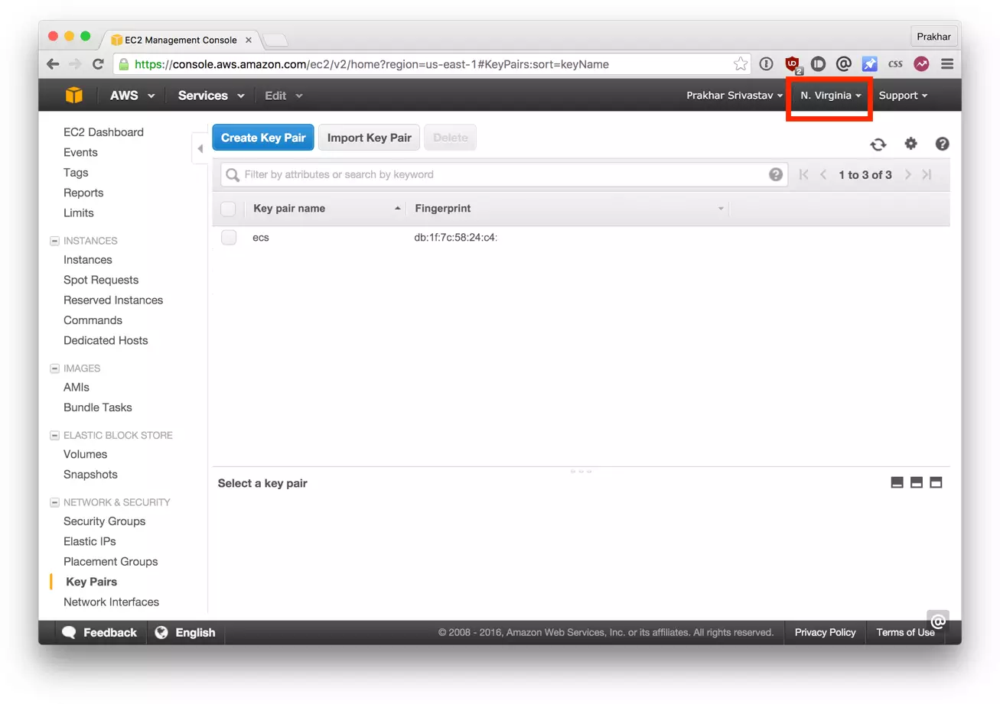

In the last section we used `docker-compose` to run our app locally with a single command: `docker-compose up`. Now that we have a functioning app we want to share this with the world, get some users, make tons of money and buy a big house in Miami. Executing the last three are beyond the scope of the tutorial, so we'll spend our time instead on figuring out how we can deploy our multi-container apps on the cloud with AWS.

If you've read this far you are pretty much convinced that Docker is a pretty cool technology. And you are not alone. Seeing the meteoric rise of Docker, almost all Cloud vendors started working on adding support for deploying Docker apps on their platform. As of today, you can deploy containers on [Google Cloud Platform](https://cloud.google.com/containers/), [AWS](https://aws.amazon.com/containers/), [Azure](https://azure.microsoft.com/en-us/overview/containers/) and many others. We already got a primer on deploying single container apps with Elastic Beanstalk and in this section we are going to look at [Elastic Container Service (or ECS)](https://aws.amazon.com/ecs/) by AWS.

AWS ECS is a scalable and super flexible container management service that supports Docker containers. It allows you to operate a Docker cluster on top of EC2 instances via an easy-to-use API. Where Beanstalk came with reasonable defaults, ECS allows you to completely tune your environment as per your needs. This makes ECS, in my opinion, quite complex to get started with.

Luckily for us, ECS has a friendly [CLI](http://docs.aws.amazon.com/AmazonECS/latest/developerguide/ECS_CLI.html) tool that understands Docker Compose files and automatically provisions the cluster on ECS! Since we already have a functioning `docker-compose.yml` it should not take a lot of effort in getting up and running on AWS. So let's get started!

The first step is to install the CLI. Instructions to install the CLI on both Mac and Linux are explained very clearly in the [official docs](http://docs.aws.amazon.com/AmazonECS/latest/developerguide/ECS_CLI_installation.html). Go ahead, install the CLI and when you are done, verify the install by running

```bash
$ ecs-cli --version
ecs-cli version 1.18.1 (7e9df84)
```

Next, we'll be working on configuring the CLI so that we can talk to ECS. We'll be following the steps as detailed in the [official guide](https://docs.aws.amazon.com/AmazonECS/latest/developerguide/ECS_CLI_Configuration.html) on AWS ECS docs. In case of any confusion, please feel free to refer to that guide.

The first step will involve creating a profile that we'll use for the rest of the tutorial. To continue, you'll need your `AWS_ACCESS_KEY_ID` and `AWS_SECRET_ACCESS_KEY`. To obtain these, follow the steps as detailed under the section titled _Access Key and Secret Access Key_ on [this page](https://docs.aws.amazon.com/cli/latest/userguide/cli-chap-configure.html#cli-quick-configuration).

```bash
$ ecs-cli configure profile --profile-name ecs-foodtrucks --access-key $AWS_ACCESS_KEY_ID --secret-key $AWS_SECRET_ACCESS_KEY
```

Next, we need to get a keypair which we'll be using to log into the instances. Head over to your [EC2 Console](https://console.aws.amazon.com/ec2/v2/home#KeyPairs:sort=keyName) and create a new keypair. Download the keypair and store it in a safe location. Another thing to note before you move away from this screen is the region name. In my case, I have named my key - `ecs` and set my region as `us-east-1`. This is what I'll assume for the rest of this walkthrough.



The next step is to configure the CLI.

```bash
$ ecs-cli configure --region us-east-1 --cluster foodtrucks
INFO[0000] Saved ECS CLI configuration for cluster (foodtrucks)
```

We provide the `configure` command with the region name we want our cluster to reside in and a cluster name. Make sure you provide the **same region name** that you used when creating the keypair. If you've not configured the [AWS CLI](https://aws.amazon.com/cli/) on your computer before, you can use the official [guide](http://docs.aws.amazon.com/cli/latest/userguide/cli-chap-getting-set-up.html), which explains everything in great detail on how to get everything going.

The next step enables the CLI to create a [CloudFormation](https://aws.amazon.com/cloudformation/) template.

```bash
$ ecs-cli up --keypair ecs --capability-iam --size 1 --instance-type t2.medium
INFO[0000] Using recommended Amazon Linux 2 AMI with ECS Agent 1.39.0 and Docker version 18.09.9-ce
INFO[0000] Created cluster                               cluster=foodtrucks
INFO[0001] Waiting for your cluster resources to be created
INFO[0001] Cloudformation stack status                   stackStatus=CREATE_IN_PROGRESS
INFO[0062] Cloudformation stack status                   stackStatus=CREATE_IN_PROGRESS
INFO[0122] Cloudformation stack status                   stackStatus=CREATE_IN_PROGRESS
INFO[0182] Cloudformation stack status                   stackStatus=CREATE_IN_PROGRESS
INFO[0242] Cloudformation stack status                   stackStatus=CREATE_IN_PROGRESS
VPC created: vpc-0bbed8536930053a6
Security Group created: sg-0cf767fb4d01a3f99
Subnet created: subnet-05de1db2cb1a50ab8
Subnet created: subnet-01e1e8bc95d49d0fd
Cluster creation succeeded.
```

Here we provide the name of the keypair we downloaded initially (`ecs` in my case), the number of instances that we want to use (`--size`) and the type of instances that we want the containers to run on. The `--capability-iam` flag tells the CLI that we acknowledge that this command may create IAM resources.

The last and final step is where we'll use our `docker-compose.yml` file. We'll need to make a few minor changes, so instead of modifying the original, let's make a copy of it. The contents of [this file](https://github.com/prakhar1989/FoodTrucks/blob/master/aws-ecs/docker-compose.yml) (after making the changes) look like (below) -

```bash
version: '2'
services:
  es:
    image: docker.elastic.co/elasticsearch/elasticsearch:7.6.2
    cpu_shares: 100
    mem_limit: 3621440000
    environment:
      - discovery.type=single-node
      - bootstrap.memory_lock=true
      - "ES_JAVA_OPTS=-Xms512m -Xmx512m"
    logging:
      driver: awslogs
      options:
        awslogs-group: foodtrucks
        awslogs-region: us-east-1
        awslogs-stream-prefix: es
  web:
    image: prakhar1989/foodtrucks-web
    cpu_shares: 100
    mem_limit: 262144000
    ports:
      - "80:5000"
    links:
      - es
    logging:
      driver: awslogs
      options:
        awslogs-group: foodtrucks
        awslogs-region: us-east-1
        awslogs-stream-prefix: web
```

The only changes we made from the original `docker-compose.yml` are of providing the `mem_limit` (in bytes) and `cpu_shares` values for each container and adding some logging configuration. This allows us to view logs generated by our containers in [AWS CloudWatch](https://aws.amazon.com/cloudwatch/). Head over to CloudWatch to [create a log group](https://console.aws.amazon.com/cloudwatch/home#logsV2:log-groups/create-log-group) called `foodtrucks`.  Note that since ElasticSearch typically ends up taking more memory, we've given around 3.4 GB of memory limit. Another thing we need to do before we move onto the next step is to publish our image on Docker Hub.

```bash
$ docker push prakhar1989/foodtrucks-web
```

Great! Now let's run the final command that will deploy our app on ECS!

```bash
$ cd aws-ecs
$ ecs-cli compose up
INFO[0000] Using ECS task definition                     TaskDefinition=ecscompose-foodtrucks:2
INFO[0000] Starting container...                         container=845e2368-170d-44a7-bf9f-84c7fcd9ae29/es
INFO[0000] Starting container...                         container=845e2368-170d-44a7-bf9f-84c7fcd9ae29/web
INFO[0000] Describe ECS container status                 container=845e2368-170d-44a7-bf9f-84c7fcd9ae29/web desiredStatus=RUNNING lastStatus=PENDING taskDefinition=ecscompose-foodtrucks:2
INFO[0000] Describe ECS container status                 container=845e2368-170d-44a7-bf9f-84c7fcd9ae29/es desiredStatus=RUNNING lastStatus=PENDING taskDefinition=ecscompose-foodtrucks:2
INFO[0036] Describe ECS container status                 container=845e2368-170d-44a7-bf9f-84c7fcd9ae29/es desiredStatus=RUNNING lastStatus=PENDING taskDefinition=ecscompose-foodtrucks:2
INFO[0048] Describe ECS container status                 container=845e2368-170d-44a7-bf9f-84c7fcd9ae29/web desiredStatus=RUNNING lastStatus=PENDING taskDefinition=ecscompose-foodtrucks:2
INFO[0048] Describe ECS container status                 container=845e2368-170d-44a7-bf9f-84c7fcd9ae29/es desiredStatus=RUNNING lastStatus=PENDING taskDefinition=ecscompose-foodtrucks:2
INFO[0060] Started container...                          container=845e2368-170d-44a7-bf9f-84c7fcd9ae29/web desiredStatus=RUNNING lastStatus=RUNNING taskDefinition=ecscompose-foodtrucks:2
INFO[0060] Started container...                          container=845e2368-170d-44a7-bf9f-84c7fcd9ae29/es desiredStatus=RUNNING lastStatus=RUNNING taskDefinition=ecscompose-foodtrucks:2
```

It's not a coincidence that the invocation above looks similar to the one we used with **Docker Compose**. If everything went well, you should see a `desiredStatus=RUNNING lastStatus=RUNNING` as the last line.

Awesome! Our app is live, but how can we access it?

```bash
ecs-cli ps
Name                                      State    Ports                     TaskDefinition
845e2368-170d-44a7-bf9f-84c7fcd9ae29/web  RUNNING  54.86.14.14:80->5000/tcp  ecscompose-foodtrucks:2
845e2368-170d-44a7-bf9f-84c7fcd9ae29/es   RUNNING                            ecscompose-foodtrucks:2
```

Go ahead and open [http://54.86.14.14](http://54.86.14.14) in your browser and you should see the Food Trucks in all its black-yellow glory!
Since we're on the topic, let's see how our [AWS ECS](https://console.aws.amazon.com/ecs/home#/clusters) console looks.


We can see above that our ECS cluster called 'foodtrucks' was created and is now running 1 task with 2 container instances. Spend some time browsing this console to get a hang of all the options that are here.

### Cleanup

Once you've played around with the deployed app, remember to turn down the cluster -

```
$ ecs-cli down --force
INFO[0001] Waiting for your cluster resources to be deleted...
INFO[0001] Cloudformation stack status                   stackStatus=DELETE_IN_PROGRESS
INFO[0062] Cloudformation stack status                   stackStatus=DELETE_IN_PROGRESS
INFO[0124] Cloudformation stack status                   stackStatus=DELETE_IN_PROGRESS
INFO[0155] Deleted cluster                               cluster=foodtrucks
```

So there you have it. With just a few commands we were able to deploy our awesome app on the AWS cloud!
