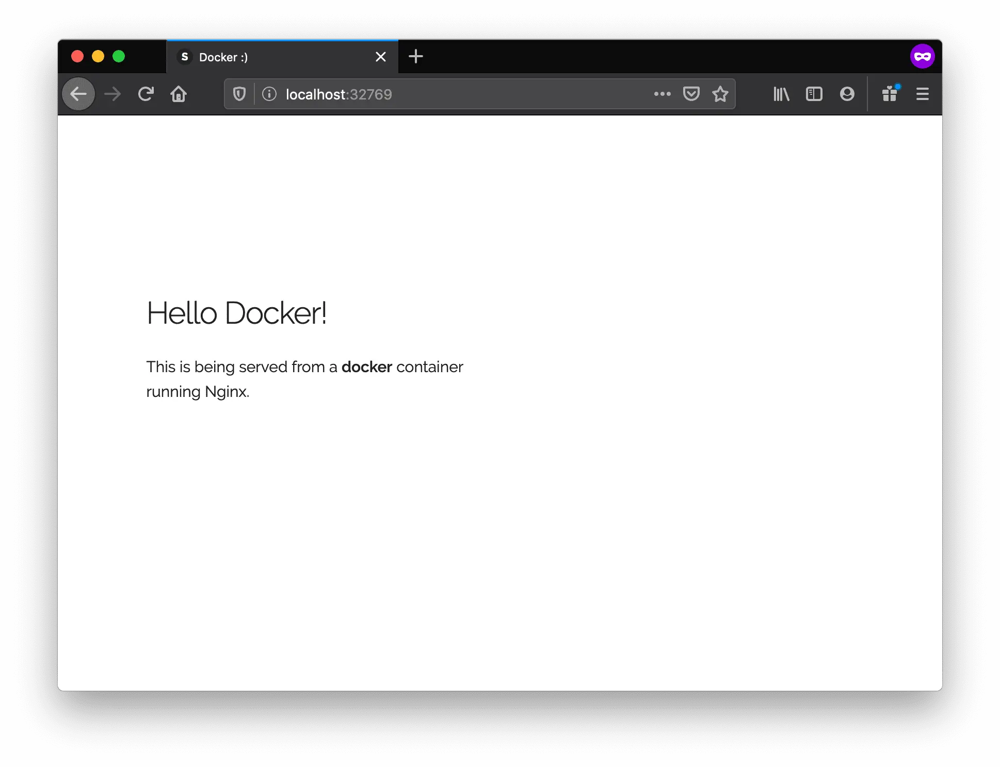

Great! So we have now looked at `docker run`, played with a Docker container and also got a hang of some terminology. Armed with all this knowledge, we are now ready to get to the real-stuff, i.e. deploying web applications with Docker!

### Static Sites

Let's start by taking baby-steps. The first thing we're going to look at is how we can run a dead-simple static website. We're going to pull a Docker image from Docker Hub, run the container and see how easy it is to run a webserver.

Let's begin. The image that we are going to use is a single-page [website](http://github.com/prakhar1989/docker-curriculum) that I've already created for the purpose of this demo and hosted on the [registry](https://hub.docker.com/r/prakhar1989/static-site/) - `prakhar1989/static-site`. We can download and run the image directly in one go using `docker run`. As noted above, the `--rm` flag automatically removes the container when it exits and the `-it` flag specifies an interactive terminal which makes it easier to kill the container with Ctrl+C (on windows).

```bash
$ docker run --rm -it prakhar1989/static-site
```

Since the image doesn't exist locally, the client will first fetch the image from the registry and then run the image. If all goes well, you should see a `Nginx is running...` message in your terminal. Okay now that the server is running, how to see the website? What port is it running on? And more importantly, how do we access the container directly from our host machine? Hit Ctrl+C to stop the container.

Well, in this case, the client is not exposing any ports so we need to re-run the `docker run` command to publish ports. While we're at it, we should also find a way so that our terminal is not attached to the running container. This way, you can happily close your terminal and keep the container running. This is called **detached** mode.

```bash
$ docker run -d -P --name static-site prakhar1989/static-site
e61d12292d69556eabe2a44c16cbd54486b2527e2ce4f95438e504afb7b02810
```

In the above command, `-d` will detach our terminal, `-P` will publish all exposed ports to random ports and finally `--name` corresponds to a name we want to give. Now we can see the ports by running the `docker port [CONTAINER]` command

```bash
$ docker port static-site
80/tcp -> 0.0.0.0:32769
443/tcp -> 0.0.0.0:32768
```

You can open [http://localhost:32769](http://localhost:32769) in your browser.

> Note: If you're using docker-toolbox, then you might need to use `docker-machine ip default` to get the IP.

You can also specify a custom port to which the client will forward connections to the container.

```bash
$ docker run -p 8888:80 prakhar1989/static-site
Nginx is running...
```



To stop a detached container, run `docker stop` by giving the container ID. In this case, we can use the name `static-site` we used to start the container.

```bash
$ docker stop static-site
static-site
```

I'm sure you agree that was super simple. To deploy this on a real server you would just need to install Docker, and run the above Docker command. Now that you've seen how to run a webserver inside a Docker image, you must be wondering - how do I create my own Docker image? This is the question we'll be exploring in the next section.