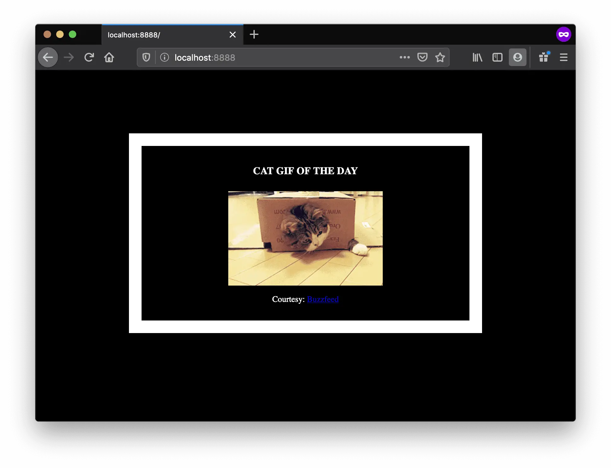

A [Dockerfile](https://docs.docker.com/engine/reference/builder/) is a simple text file that contains a list of commands that the Docker client calls while creating an image. It's a simple way to automate the image creation process. The best part is that the [commands](https://docs.docker.com/engine/reference/builder/#from) you write in a Dockerfile are _almost_ identical to their equivalent Linux commands. This means you don't really have to learn new syntax to create your own dockerfiles.

The application directory does contain a Dockerfile but since we're doing this for the first time, we'll create one from scratch. To start, create a new blank file in our favorite text-editor and save it in the **same** folder as the flask app by the name of `Dockerfile`.

We start with specifying our base image. Use the `FROM` keyword to do that — we will use `python:3.12-slim`, a lightweight Linux image with Python preinstalled:

```dockerfile
FROM python:3.12-slim
```

Next, we set a working directory for our app inside the container:

```dockerfile
# set a directory for the app
WORKDIR /usr/src/app
```

Now comes an important concept: **Docker Layer Caching**. Each instruction in a Dockerfile creates a cached layer. To optimize build speed when code changes, we copy `requirements.txt` and install dependencies **before** copying the rest of the application source files. That way, Docker can re-use the cached `pip install` layer unless `requirements.txt` changes!

```dockerfile
# copy requirements file and install dependencies
COPY requirements.txt .
RUN pip install --no-cache-dir -r requirements.txt

# copy all remaining files to the container
COPY . .
```

The next thing we need to specify is the port number that needs to be exposed. Since our flask app is running on port `5000`, that's what we'll indicate.

```dockerfile
EXPOSE 5000
```

The last step is to write the command for running the application, which is simply — `python ./app.py`. We use the [CMD](https://docs.docker.com/engine/reference/builder/#cmd) command to do that —

```dockerfile
CMD ["python", "./app.py"]
```

The primary purpose of `CMD` is to tell the container which command it should run when it is started. With that, our `Dockerfile` is now ready. This is how it looks —

```dockerfile
FROM python:3.12-slim

# set a directory for the app
WORKDIR /usr/src/app

# copy requirements file and install dependencies
COPY requirements.txt .
RUN pip install --no-cache-dir -r requirements.txt

# copy all remaining files to the container
COPY . .

# define the port number the container should expose
EXPOSE 5000

# run the command
CMD ["python", "./app.py"]
```

Now that we have our `Dockerfile`, we can build our image. The `docker build` command does the heavy-lifting of creating a Docker image from a `Dockerfile`.

The section below shows you the output of running the command. Before you run it yourself (don't forget the period at the end), make sure to replace `yourusername` with your Docker Hub username. The `docker build` command takes an optional tag name with `-t` and a location of the directory containing the `Dockerfile`.

```bash
$ docker build -t yourusername/catnip .
[+] Building 2.4s (10/10) FINISHED
 => [internal] load build definition from Dockerfile
 => => transferring dockerfile: 312B
 => [internal] load .dockerignore
 => [1/5] FROM docker.io/library/python:3.12-slim
 => [2/5] WORKDIR /usr/src/app
 => [3/5] COPY requirements.txt .
 => [4/5] RUN pip install --no-cache-dir -r requirements.txt
 => [5/5] COPY . .
 => exporting to image
 => => naming to docker.io/yourusername/catnip
```

If you don't have the `python:3.12-slim` image locally, Docker will first pull the image and then build your app image. If everything went well, your image should be ready! Run `docker image ls` to list your images.

The last step in this section is to run the image and see if it actually works (replacing `yourusername` with yours).

```bash
$ docker run -p 8888:5000 yourusername/catnip
 * Running on http://0.0.0.0:5000/ (Press CTRL+C to quit)
```

The command we just ran used port 5000 for the server inside the container and exposed this externally on host port 8888. Head over to `http://localhost:8888` in your browser, where your app should be live.

> **macOS Note (Port 5000 Conflict):** On macOS Monterey (12.0) and later, Apple's AirPlay Receiver feature listens on host port `5000` by default. If you ever try binding port 5000 directly to the host (`-p 5000:5000`) and get an error `port is already allocated`, you can either map to a different host port (like `-p 8888:5000` as shown above) or disable AirPlay Receiver in **System Settings > General > AirDrop & Handoff**.



Congratulations! You have successfully created and built your first Docker image.
