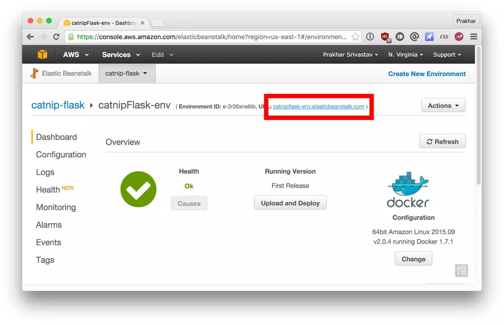

What good is an application that can't be shared with friends, right? So in this section we are going to see how we can deploy our awesome application to the cloud so that we can share it with our friends! We're going to use AWS [Elastic Beanstalk](https://aws.amazon.com/elasticbeanstalk/) to get our application up and running in a few clicks. We'll also see how easy it is to make our application scalable and manageable with Beanstalk!

#### Docker push

The first thing that we need to do before we deploy our app to AWS is to publish our image on a registry which can be accessed by AWS. There are many different [Docker registries](https://aws.amazon.com/ecr/) you can use (you can even host [your own](https://docs.docker.com/registry/deploying/)). For now, let's use [Docker Hub](https://hub.docker.com) to publish the image.

If this is the first time you are pushing an image, the client will ask you to login. Provide the same credentials that you used for logging into Docker Hub.

```bash
$ docker login
Login in with your Docker ID to push and pull images from Docker Hub. If you do not have a Docker ID, head over to https://hub.docker.com to create one.
Username: yourusername
Password:
WARNING! Your password will be stored unencrypted in /Users/yourusername/.docker/config.json
Configure a credential helper to remove this warning. See
https://docs.docker.com/engine/reference/commandline/login/credential-store

Login Succeeded
```

To publish, just type the below command remembering to replace the name of the image tag above with yours. It is important to have the format of `yourusername/image_name` so that the client knows where to publish.

```bash
$ docker push yourusername/catnip
```

Once that is done, you can view your image on Docker Hub. For example, here's the [web page](https://hub.docker.com/r/prakhar1989/catnip/) for my image.

> Note: One thing that I'd like to clarify before we go ahead is that it is not **imperative** to host your image on a public registry (or any registry) in order to deploy to AWS. In case you're writing code for the next million-dollar unicorn startup you can totally skip this step. The reason why we're pushing our images publicly is that it makes deployment super simple by skipping a few intermediate configuration steps.

Now that your image is online, anyone who has docker installed can play with your app by typing just a single command.

```bash
$ docker run -p 8888:5000 yourusername/catnip
```

If you've pulled your hair out in setting up local dev environments / sharing application configuration in the past, you very well know how awesome this sounds. That's why Docker is so cool!

#### Beanstalk

AWS Elastic Beanstalk (EB) is a PaaS (Platform as a Service) offered by AWS. If you've used Heroku, Google App Engine etc. you'll feel right at home. As a developer, you just tell EB how to run your app and it takes care of the rest - including scaling, monitoring and even updates. In April 2014, EB added support for running single-container Docker deployments which is what we'll use to deploy our app. Although EB has a very intuitive [CLI](http://docs.aws.amazon.com/elasticbeanstalk/latest/dg/eb-cli3.html), it does require some setup, and to keep things simple we'll use the web UI to launch our application.

To follow along, you need a functioning [AWS](http://aws.amazon.com) account. If you haven't already, please go ahead and do that now - you will need to enter your credit card information. But don't worry, it's free and anything we do in this tutorial will also be free! Let's get started.

Here are the steps:

- Login to your AWS [console](http://console.aws.amazon.com).
- Click on Elastic Beanstalk. It will be in the compute section on the top left. Alternatively, you can access the [Elastic Beanstalk console](https://console.aws.amazon.com/elasticbeanstalk).


- Click on "Create New Application" in the top right
- Give your app a memorable (but unique) name and provide an (optional) description
- In the **New Environment** screen, create a new environment and choose the **Web Server Environment**.
- Fill in the environment information by choosing a domain. This URL is what you'll share with your friends so make sure it's easy to remember.
- Under base configuration section. Choose _Docker_ from the _predefined platform_.


- Now we need to upload our application code. But since our application is packaged in a Docker container, we just need to tell EB about our container. Open the `Dockerrun.aws.json` [file](https://github.com/prakhar1989/docker-curriculum/blob/master/flask-app/Dockerrun.aws.json) located in the `flask-app` folder and edit the `Name` of the image to your image's name. Don't worry, I'll explain the contents of the file shortly. When you are done, click on the radio button for "Upload your Code", choose this file, and click on "Upload".
- Now click on "Create environment". The final screen that you see will have a few spinners indicating that your environment is being set up. It typically takes around 5 minutes for the first-time setup.

While we wait, let's quickly see what the `Dockerrun.aws.json` file contains. This file is basically an AWS specific file that tells EB details about our application and docker configuration.

```json
{
  "AWSEBDockerrunVersion": "1",
  "Image": {
    "Name": "prakhar1989/catnip",
    "Update": "true"
  },
  "Ports": [
    {
      "ContainerPort": 5000,
      "HostPort": 8000
    }
  ],
  "Logging": "/var/log/nginx"
}
```

The file should be pretty self-explanatory, but you can always [reference](http://docs.aws.amazon.com/elasticbeanstalk/latest/dg/create_deploy_docker_image.html#create_deploy_docker_image_dockerrun) the official documentation for more information. We provide the name of the image that EB should use along with a port that the container should open.

Hopefully by now, our instance should be ready. Head over to the EB page and you should see a green tick indicating that your app is alive and kicking.



Go ahead and open the URL in your browser and you should see the application in all its glory. Feel free to email / IM / snapchat this link to your friends and family so that they can enjoy a few cat gifs, too.

#### Cleanup

Once you done basking in the glory of your app, remember to terminate the environment so that you don't end up getting charged for extra resources.


Congratulations! You have deployed your first Docker application! That might seem like a lot of steps, but with the [command-line tool for EB](https://docs.aws.amazon.com/elasticbeanstalk/latest/dg/eb-cli3.html) you can almost mimic the functionality of Heroku in a few keystrokes! Hopefully, you agree that Docker takes away a lot of the pains of building and deploying applications in the cloud. I would encourage you to read the AWS [documentation](http://docs.aws.amazon.com/elasticbeanstalk/latest/dg/docker-singlecontainer-deploy.html) on single-container Docker environments to get an idea of what features exist.

In the next (and final) part of the tutorial, we'll up the ante a bit and deploy an application that mimics the real-world more closely; an app with a persistent back-end storage tier. Let's get straight to it!